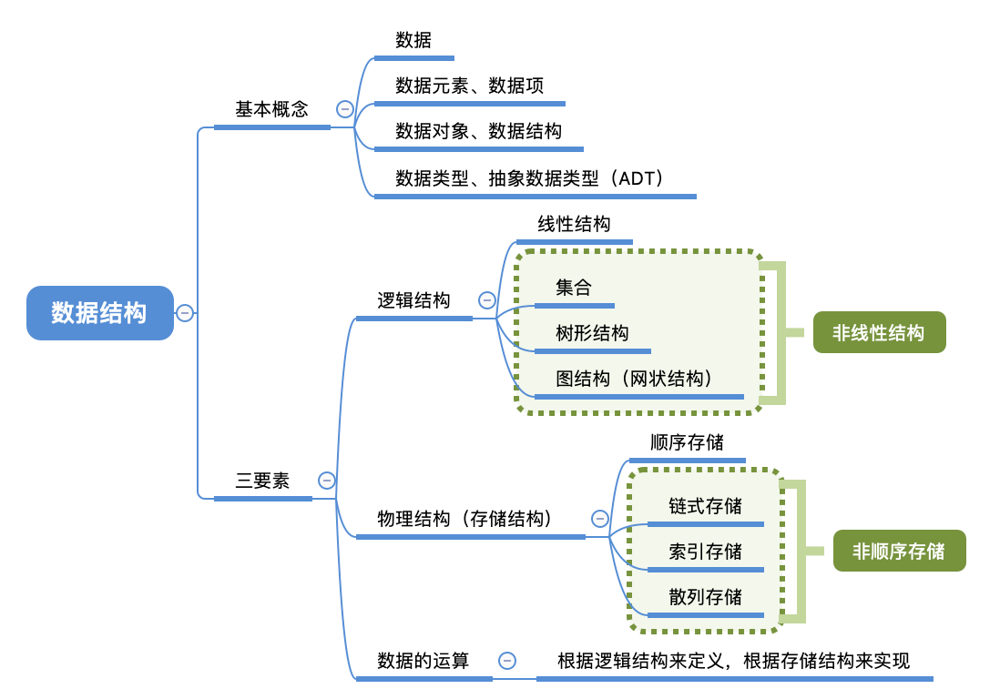
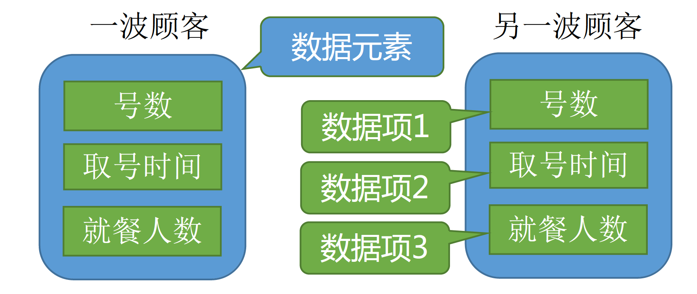
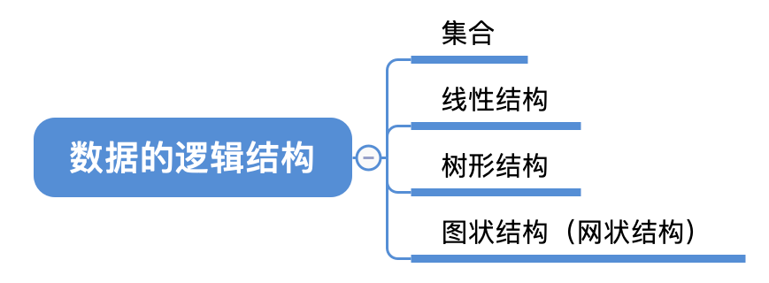
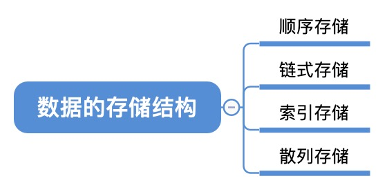
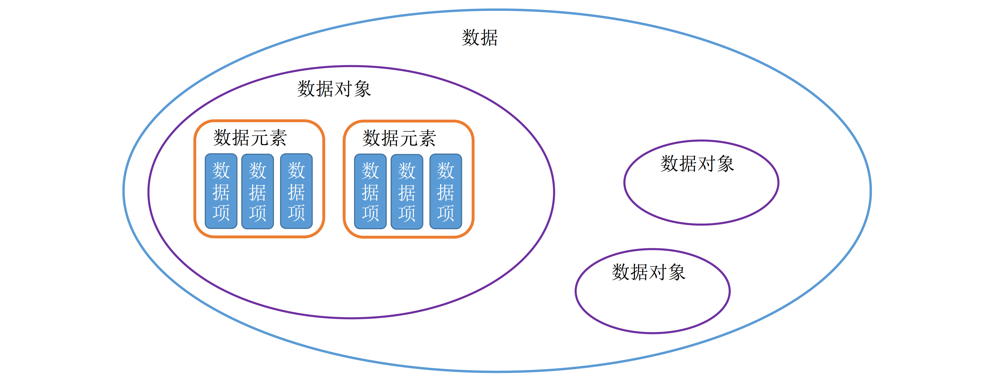

# 第一章  绪论

## 1.1  数据结构的基本概念

### 1.1.1  基本概念和术语

#### 1.数据

数据是**信息的载体**，是描述客观事物属性的数、字符及所有**能输入到计算机中并被计算机程序识别和处理**的符号的集合。数据是计算机程序加工的原料。

#### 2.数据元素

数据元素是数据的基本单位，通常作为一个整体进行考虑和处理。
一个数据元素可由若干**数据项**组成，数据项是构成数据元素的不可分割的最小单位。

#### 3.数据对象

数据对象是具有**相同性质**的数据元素的集合，是数据的一个子集。

#### 4.数据类型

#### 5.数据结构

数据结构是相互之间存在一种或多种**特定关系**的数据元素的集合。

### 1.1.2  数据结构三要素

#### 1.数据的逻辑结构

数据的逻辑结构——数据元素之间的逻辑关系

#### 2.数据的存储结构

#### 3.数据的运算

数据的运算——施加在数据上的运算包括运算的定义和实现。运算的定义是针对逻辑结构的，指出运算的功能；运算的实现是针对存储结构的，指出运算的具体操作步骤。

绪论部分只需要理解两点：

1.若采用顺序存储，则各个数据元素在物理上必须是连续的；若采用非顺序存储，则各个数据元素在物理上可以是离散的。

2.数据的存储结构会影响存储空间分配的方便程度

3.数据的存储结构会影响对数据运算的速度

## 1.2  算法和算法评价

### 1.2.1  算法的基本概念

### 1.2.2   算法效率的度量

### 归纳总结

### 思维拓展

## 一、 绪论 00:06

数据结构课程从第一章绪论部分开始。绪论章节虽非 $408$ 大纲要求内容，但有助于建立学习思维框架，为后续数据结构学习提供方法论指导。

#### 1. 数据结构的基本概念 00:28

本节介绍数据结构相关基本概念，将关联性强的概念集中讲解以辅助理解。

##### 1) 知识总览 00:39

数据结构三要素包括逻辑结构、物理结构和数据运算。抽象数据类型需在三要素理解后学习。本节概念较多但非核心重点，后续课程会逐步深化理解。

##### 2) 数据 01:23

数据是信息的载体，可描述客观事物并转换为计算机可处理的二进制符号集合。

##### 3) 数据元素、数据项 01:58

数据元素是数据的基本单位，由若干数据项组成。具体划分需根据实际业务需求确定。

- 例题：海底捞排队系统数据元素、数据项 02:25
海底捞排队系统中，每波顾客信息为一个数据元素，包含号数、取号时间、就餐人数等数据项。
- 例题：微博账户信息数据元素、数据项 03:06
微博账户信息中，每个账号为一个数据元素，包含昵称、性别、生日等数据项。生日可拆分为年、月、日等组合项。

##### 4) 数据结构、数据对象 03:57

数据结构关注数据元素间的关系，数据对象仅要求元素性质相同。

- 数据结构 04:33
数据结构是存在特定关系的数据元素集合。
- 以海底捞排队为例，同一门店顾客信息存在先后关系，构成数据结构；不同门店顾客信息性质相同但无直接关联，属于同一数据对象。
- 例题：数据结构示例 05:56
数据结构强调元素间关系（如排队顺序），数据对象仅需元素性质一致（如所有门店顾客信息）。

数据结构三要素 06:32

- 逻辑结构 06:40
  逻辑结构分为四种：
  - 集合：元素同属集合但无其他关系（如烤盘食物）。
  - 线性结构：元素一对一关系（如烤串、排队队列）。
  - 树形结构：元素一对多关系（如目录层级）。
  - 图状结构：元素多对多关系（如微信好友网络）。
- 物理结构 09:59
  物理结构（存储结构）分为四种：

| 存储方式 |            特点            |      示例      |
| :------: | :------------------------: | :------------: |
| 顺序存储 |    逻辑相邻元素物理相邻    |  连续内存分配  |
| 链式存储 |  通过指针链接逻辑相邻元素  |  离散内存分配  |
| 索引存储 |   通过索引表记录元素位置   | 需额外存储索引 |
| 散列存储 | 根据关键字直接计算存储地址 |   哈希表实现   |

顺序存储要求物理空间连续，非顺序存储（链式 / 索引 / 散列）分配更灵活但查找效率可能较低。

- 数据的运算 15:20
  数据的运算通常基于逻辑结构定义，需明确对数据执行的操作类型。不同存储结构会导致运算实现方式的差异。

  以队列为例：

  - 队头元素出队：如服务员叫号场景。
  - 新元素入队：如新顾客取号插入队尾。

运算实现与存储结构密切相关：

| 存储结构 |        插入操作实现方式        |
| :------: | :----------------------------: |
| 顺序存储 | 新元素必须放置连续存储空间末端 |
| 链式存储 | 新元素可任意存放并通过指针链接 |

数据结构三要素（逻辑结构、存储结构、运算）贯穿后续所有数据结构讨论。

##### 5) 数据类型、抽象数据类型 17:32

数据类型 17:34
数据类型包含值的集合及该集合上定义的操作集合，可分为：

- 原子类型：值不可再分（如布尔型、整型）。
  - 布尔型：值域 $\{\text{true}, \text{false}\}$，操作集合 $\{$与、或、非$\}$。
  - 整型：值域受编程语言限制，操作集合 $\{$加、减、乘、模运算$\}$。
- 结构类型 18:44
  结构类型特征：
  - 值可分解为多个分量（如 C 语言 `struct`）。
  - 值域与操作由业务需求定义，例如：
    - 排队顾客号数范围：$1 - 999$。
    - 每桌人数上限：$12$ 人。
    - 拼桌操作需合并 `people` 字段。

抽象数据类型 20:09
抽象数据类型（ADT）核心特征：

- 仅定义数据的逻辑结构与运算（数学化描述）。
- 不涉及具体存储结构实现.
- 存储结构选择影响运算具体实现方式。

#### 2. 知识回顾与重要考点 20:53

核心概念关系：
- 数据对象：具有相同性质的数据元素集合。
- 数据结构三要素：
  - 逻辑结构
  - 存储结构
  - 运算
- 抽象数据类型：确定逻辑结构与运算，存储结构在实现阶段考虑。

学习建议：绪论章节概念可通过后续内容实践逐步深化理解。
