# 一、大纲详解 02:20

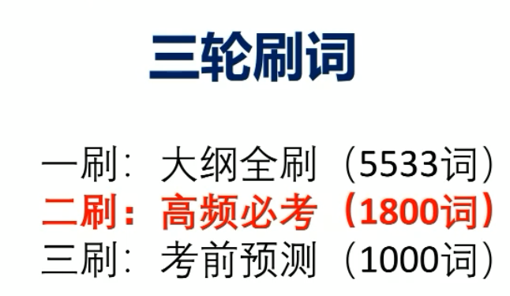

## 大纲：考研英语的唯一课本

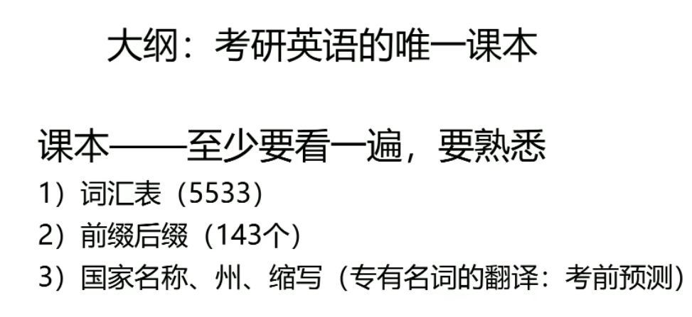

第一轮大纲复习至关重要，新学员需明确大纲的核心地位。全刷大纲是基础学习阶段的关键环节。 

#### 1.大纲的重要性 02:58

考研英语大纲是唯一官方教材，需至少通读一遍以熟悉内容框架。 

#### 2.大纲的构成 03:09

大纲包含以下内容： 

- 词汇表（含5533个核心词及143个前缀后缀） 
- 国家、州名、缩写及专有名词（翻译题型高频考点） 
- 考前专项资料（涵盖人名、地名、哲学家、文学家等18年更新内容）重点案例：Atlantic曾被误译为“亚特兰蒂斯”，实际应为“大西洋”。 

#### 3.超纲词 05:31

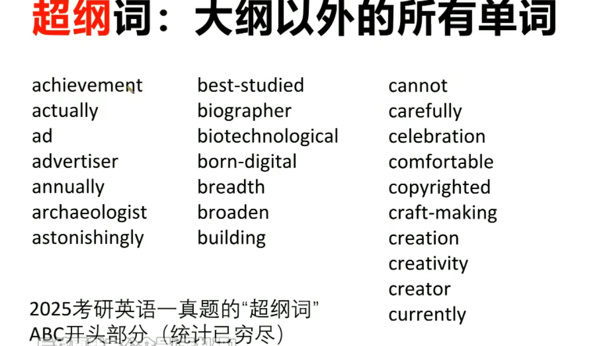

超纲词无需额外记忆，其特点如下： 

- 多数为大纲词派生（如achievement→achieve，actually→actual） 
- 极少数可能成为考点（如阅读猜词题中的transgression=违背道德）特殊案例：archaeologist（考古学家）等学科术语已纳入考前预测1000词。 

##### 1) 大纲单词的重要性 10:32

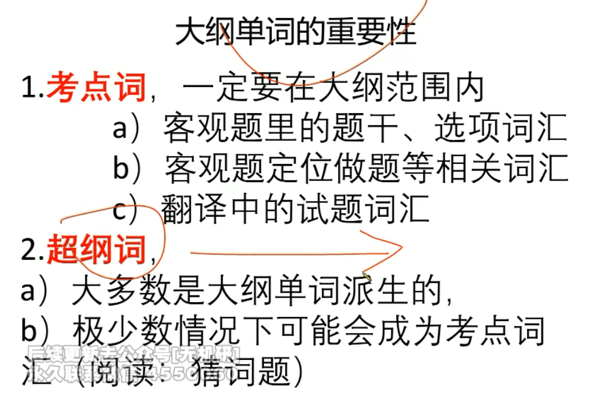

- 考点词 10:37

考点词集中于客观题（完型、新题型、阅读定位词），需重点掌握题干及解题关键词。 

- 超纲词 11:05

超纲词派生规律明显（如advertisement→advertise），仅少数独立词汇可能成为考点。 

- 应用案例 11:34
  - 例题:超纲词阅读理解例题分析：transgression（违背道德）选项辨析，正确答案为d（run doing）。 

### 二、词汇课程内容 13:08

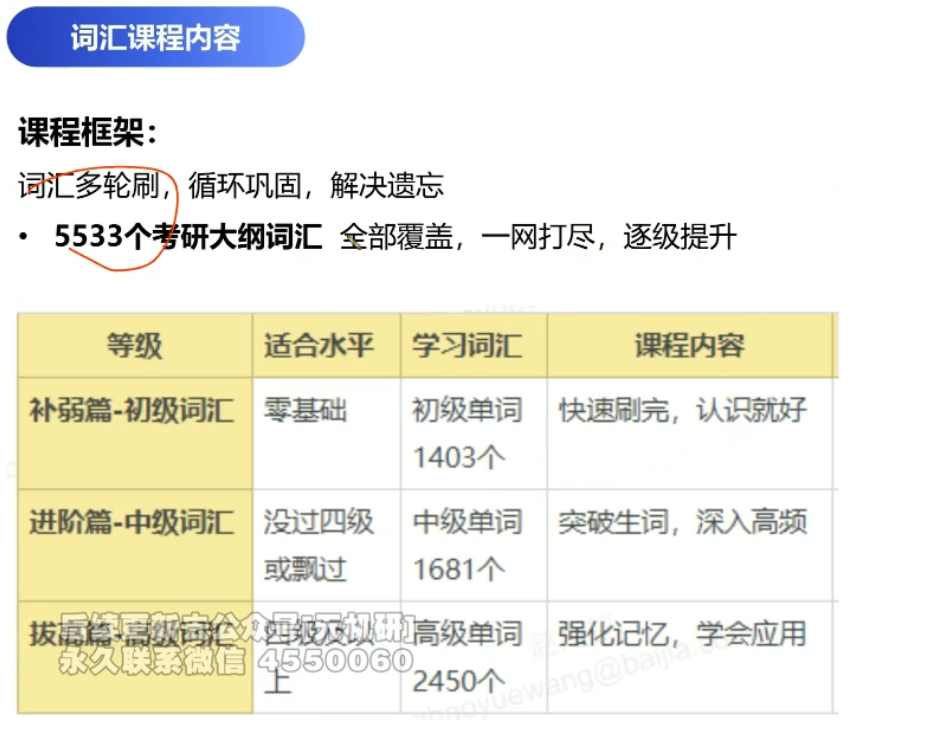

#### 1.拔高篇-高级词汇：9级及以上，高级单词2450个

词汇分级目标： 

- 初级：未过四级者需补基础 
- 中级：四六级水平 
- 高级：2450个高频核心词 

#### 2.考研英语词汇三轮刷词 13:28

刷词计划： 

- 第一轮：自主通刷大纲词汇 
- 第二轮：结合高频词课程同步复习 
- 第三轮：考前专项检测（如超纲词抽查） 

### 三、三轮刷词 16:27

高频必考1800词直播课程本周启动，内容基于历年真题词频统计，全程直播授课。

#### 1.三轮刷词的介绍 17:39

高频必考词来源于大纲与试卷的结合。大纲代表理想，试卷反映现实。 

#### 2.高频必考词 18:19

##### 1) 选词逻辑 18:26

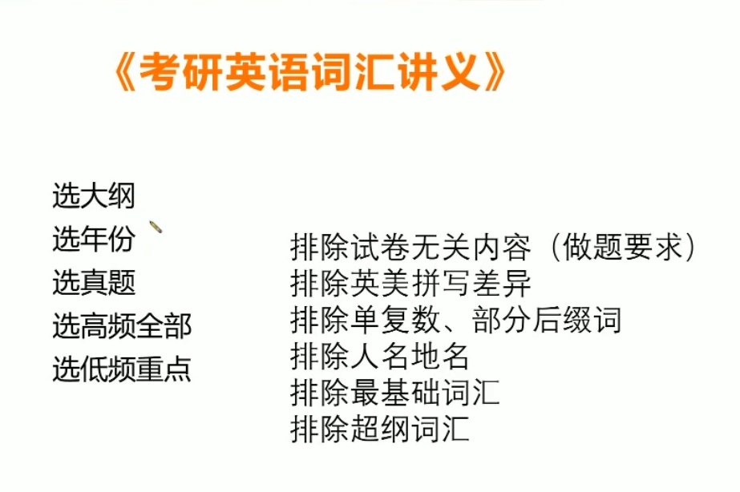

- 选大纲、年份、真题的原因及2005年题型与现在一致1800高频必考词结合大纲与试卷数据，筛选逻辑如下： 

- 选大纲：涵盖2005年至今的词汇变动（新增、删减、词根词缀变化）。 

- 选年份：从2005年开始研究，因2005年试卷题型与当前一致（如新题型“七选五”已存在）。 

- 选真题：排除无关内容（如完形填空的纯白板题目要求），区分英语一与英语二。 

- 2005年后题型变化及课程安排 21:05

- 2005年后：课程从导学过渡到高频词集中学习。 

- 2010年后：英语一与英语二正式分开命题。 

- 例题1:2014年全国硕士研究生入学统一考试英语（一）试题 21:48

- 英美拼写差异的排除及原因 22:20

  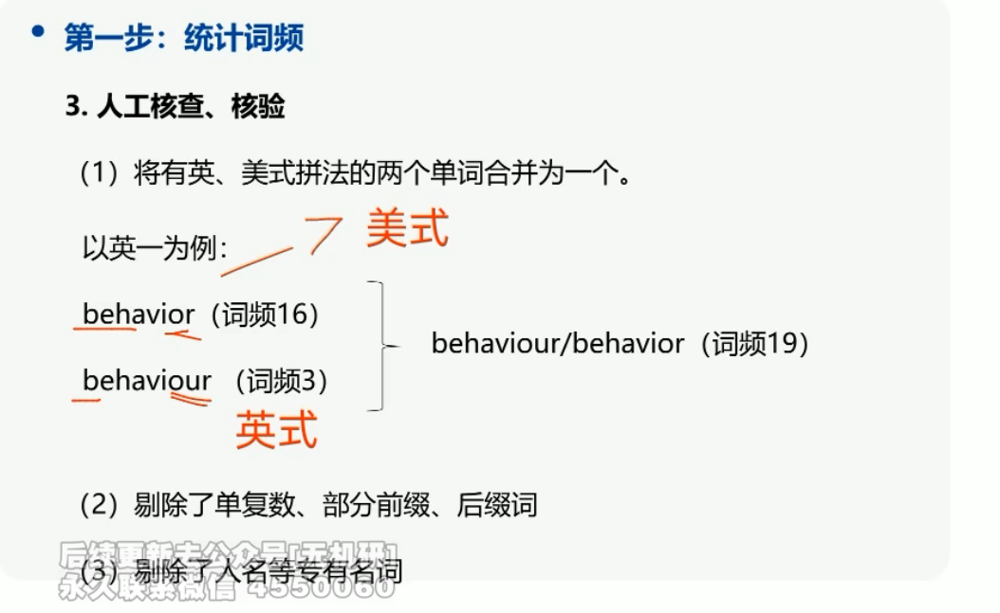

  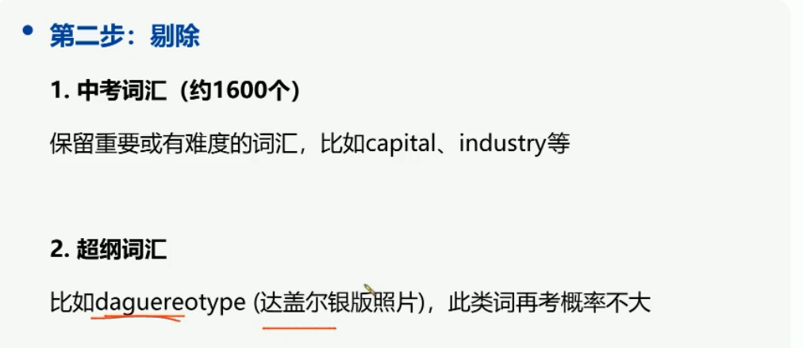

  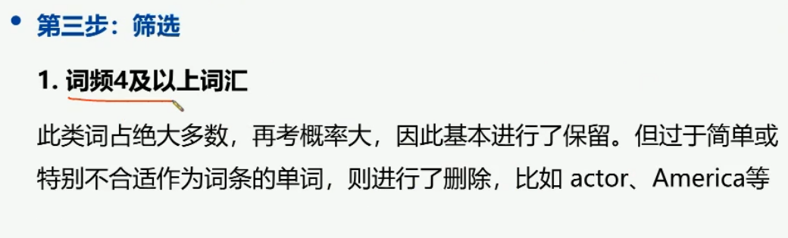

| 拼写类型 | 示例              | 考频 | 命题倾向 |
| -------- | ----------------- | ---- | -------- |
| 美式拼写 | behavior（-or）   | 16次 | 高频选用 |
| 英式拼写 | behaviour（-our） | 3次  | 低频出现 |

原因：考研文章多选自美国报刊，命题人更倾向美式拼写。 

- 剔除中考词汇和超纲词汇 24:54

排除超纲词（如“daguerreotype”达盖尔影版）及基础初中词汇，除非词汇在真题中具有特殊考点意义。 

- 保留重要或有难度的中考词汇 26:20

保留以下易忽略多义词： 

- capital：首都、资本、工商业中心；短语“make capital out of”意为“从中获利”。 
- industry：工业、从业人员、勤奋（衍生形容词“industrious”）。 
- 词频4及以上词汇的筛选和保留 29:39

删除词频≥4但无考点价值的词汇，保留高频且具命题潜力的词汇。 

- 词频1-3的词汇的筛选和保留 30:15

筛选低频但出现在题干/选项的词汇（如“crude”）： 

- crude：粗糙的、简陋的、原始的（2013年翻译题考点）。 
- 无需记忆所有中文释义，重点掌握真题考查的语境含义。
- 听课注意事项及纸质版讲义获取方式 34:53

听课需注意以下要点：课程核心内容为词汇学习方法。

##  听课重点

##### 2) 抓主要矛盾 35:11

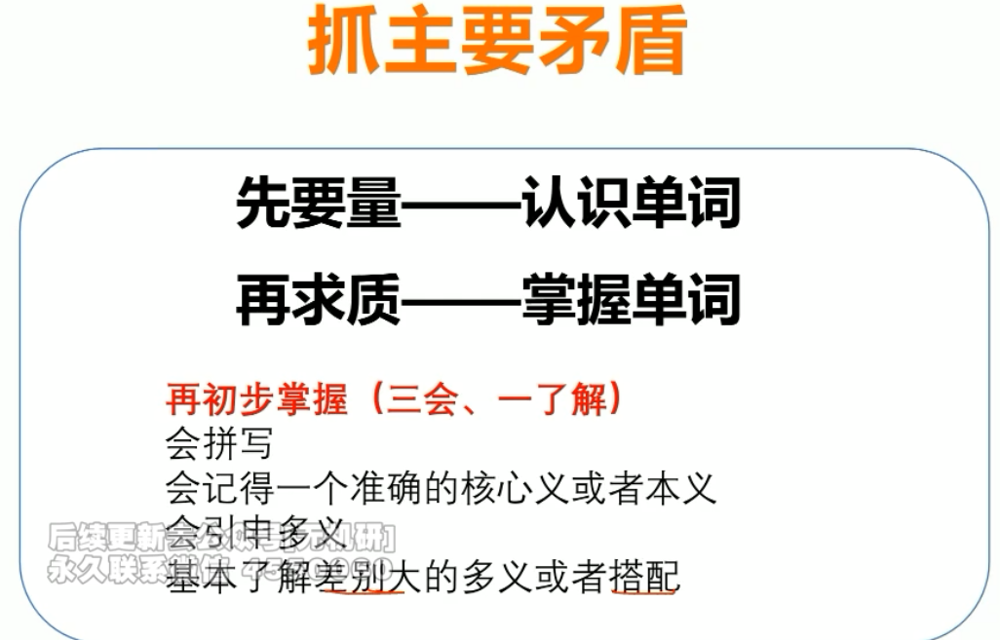

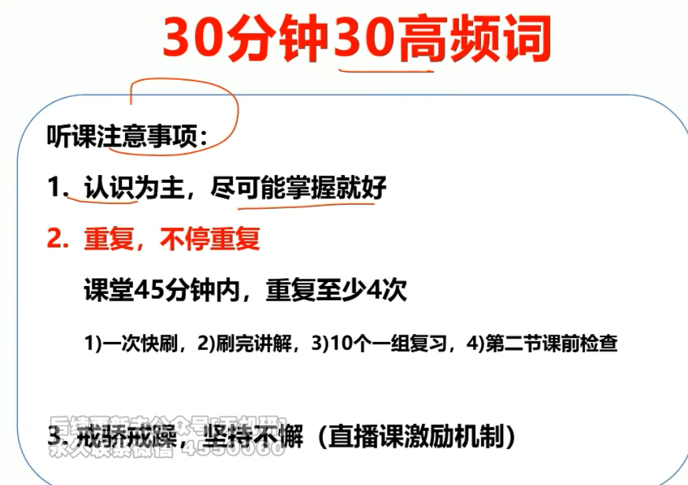

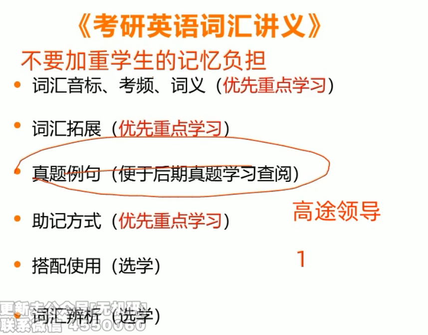

学习重点应聚焦于抓主要矛盾，遵循**先认识后掌握**的原则。 

- 认识：大概知道单词含义 35:23

认识指对单词含义的初步了解。例如： 

- crude包含粗糙、粗鲁、简陋、原始、未加工等多重含义，只需记住与“粗”或“天然”相关的核心概念即可。 
- 基本要求为30分钟内认识30个词汇。 
- 掌握：会拼写、会引申多义 37:19

掌握需达到以下标准： 

- **会拼写**：避免作文拼写错误扣分。 
- **会记准核心义或本义**：如crude需精确记忆为“粗俗”或“粗鲁”。 
- **会引申多义**：如measure本意为“方法”，需能联想到“措施”“方式”等同义表达。 
- 基本了解差别大的多义或搭配：如measure另有“程度”“测量”含义；rest upon与“休息”无关，需掌握“依靠”“依赖”等特殊搭配。 
- 听课注意事项：认识为主，尽可能掌握 43:38

学习策略以认识词汇为主，并尽可能掌握。真题例句无需重点学习，避免时间浪费。 

##### 3) 讲义包含模块 44:43

- 讲义模块构成及学习优先级讲义中真题例句模块为附加内容，非核心学习材料。优先学习音标、考评词义及词汇拓展部分。 
- 例题1：automatic与automation的考频及拓展 46:30

| 词汇       | 词性   | 考频                 | 适用考试  |
| ---------- | ------ | -------------------- | --------- |
| automation | 名词   | 15次以上（考研整体） | 英语 - 二 |
| automatic  | 形容词 | 6次以上（仅英语二）  | 英语二    |

- 例题2：demonstrate的考频及拓展 48:32

|    词汇     |         考频          |       核心含义       |
| :---------: | :-------------------: | :------------------: |
| demonstrate | 英语一10次，英语二2次 |      说明、证明      |
|    demo     |    艺术类场景常见     | 样本、展示（如展车） |

- 词汇辨析的学习建议 50:25

词汇辨析内容建议选择性学习，重点应放在主要矛盾及讲义核心内容上。

##### 4) 帮助记忆方法 50:36

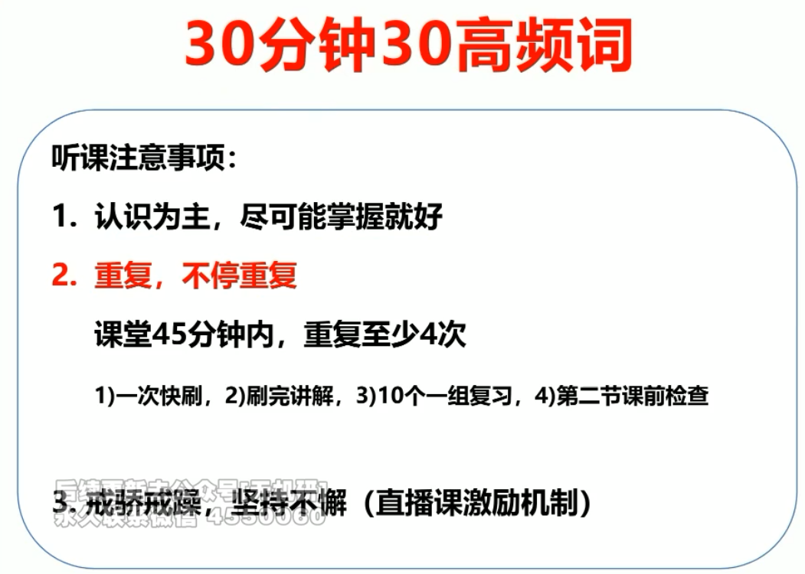

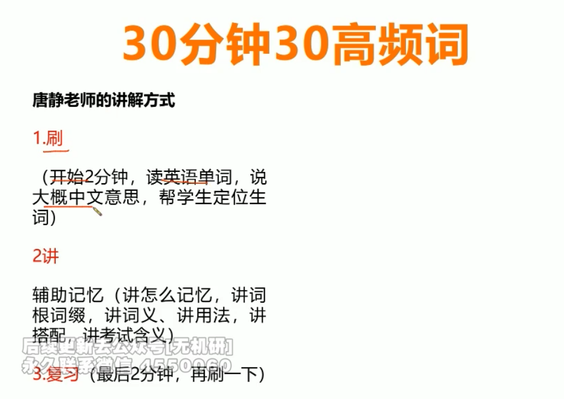

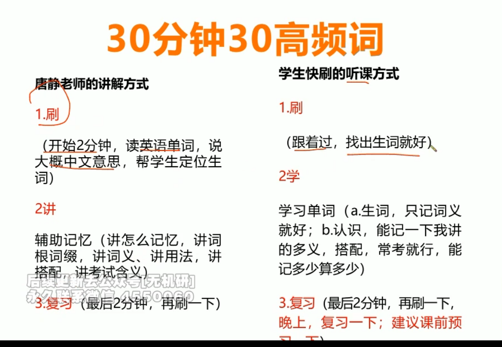

记忆强化通过重复实现从暂时记忆到常识记忆的转化。课程时长调整为45分钟，每周讲解约120个词汇。教学流程分为三阶段： 

- 快速浏览：2分钟内朗读英语单词并标注中文释义，识别生词 
- 辅助记忆：通过词根词缀、词义解析、用法搭配等手段强化记忆 
- 即时复习：讲解后立即进行复习巩固 
- 词根词缀 54:39

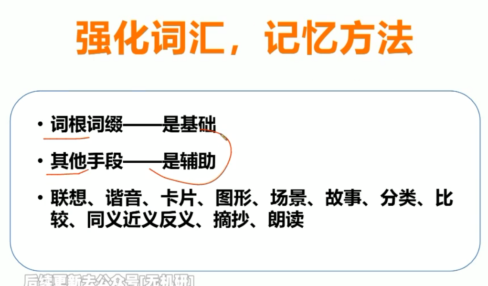

词根词缀是词汇记忆的基础，辅助手段包括联想、谐音、图形化、场景化等。例如： 

- chain（链条）与link（链环）的辨析可通过实物图示明确差异 
- 例题:谐音记忆单词 55:01

谐音记忆法存在局限性。以link（联系）与chain（链条）为例： 

- link谐音“连”易与chain混淆 
- 图形辅助可清晰区分两者概念 

##### 5) 听课方式 58:39

- 听课注意事项建议课前预习与课后复习结合，每周120词需多轮巩固。 
- 直播课激励机制 59:09

激励机制侧重进步显著与坚持学习的学员。 

- 直播课奖品设置 59:48

奖品设置包括： 

- 朗文词典（每两月赠送一本） 
- 派克钢笔、康奈尔笔记本等附加奖励 
- 月度特别奖励 
- 老师口音提醒 01:01:30

需注意教师重庆口音可能对英语发音产生影响。 

### 四、结束 01:01:47

考研需保持坚持与努力。课程后期将直接进入高强度词汇训练。