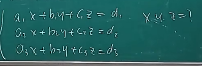
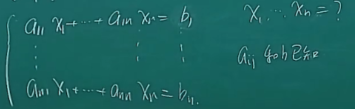
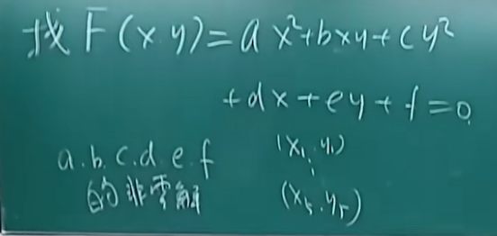
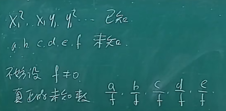
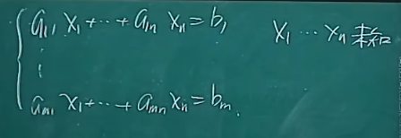
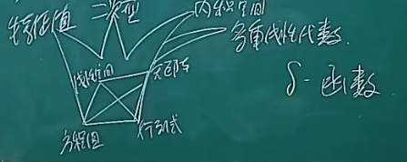

### 一、线性代数 

本课程面向电子系开设的线性代数课程，与其他院系课程内容差异不大。课程采用线上直播与录像相结合的形式，建议学生尽量到教室听课，以避免网络或设备问题影响学习效果。教室黑板存在视野遮挡问题，摄像头拍摄时黑板顶部内容可能被遮挡，需及时记录笔记。课程教材选择存在争议，最终以教学大纲为准，确保80%核心知识点覆盖。 

#### 1.线性代数简介

线性代数的教学体系存在多样性，与微积分不同，其教材编写和教学方法尚未形成统一标准。 

##### 1) 教材争议

- 教材选择争议：清华曾多次修订教材，近年引入MIT教材后因内容过浅且需英语阅读被调整，后改用钱银和杨一龙编写的新教材。 
- 教材问题：新教材虽解决部分旧问题，但引发新争议，最终教学团队允许教师自主选择教材，仅需覆盖统一教学大纲的80%核心内容。 
- 其他教材：David C. Lay的《线性代数及其应用》因语言和衔接问题未被广泛采用。 

##### 2) 考核方式

- 成绩构成：期中考试（20%）、期末考试（60%）、平时作业（20%），期末考试占比最高。 
- 调整选项：允许申请取消期中成绩，将占比转移至期末（变为平时20%+期末80%），但需教师同意。 
- 考试纪律：严禁作弊，作业需独立完成并通过网络学堂提交。 
- 习题课安排：第四周后根据班级人数分配教室，具体通知另行发布。 

# 0  绪论

## 0.1  什么是线性代数

#### 2.线性代数简史

- 定义复杂性：线性代数（简称 LA）无明确主干结构，不同于微积分的极限-微分-积分逻辑链。 
- 历史发展：由多地区独立发展的数学主题抽象整合而成，1930 年 van der Waerden（范德瓦登）首次在《近世代数》中提出“线性代数”术语，原指抽象环的模理论，后演变为**实数域线性空间**等实用内容。 
- 抽象与具体：抽象化简化问题但降低实用性，课程侧重具体应用，如解实数线性方程组。 
- 核心主题：包括矩阵运算、向量空间、特征值等，需结合历史背景理解其多样性。

## 0.2  线性代数简史

### 1) 线性方程组

- 线性方程组时代

- 线性方程组的早期形式：包含三个未知数（x、y、z）和三个方程的简单方程组。

   

- 历史背景：此类问题最早出现在两河流域的巴比伦（美索不达米亚）文明中。 

- 例题1:苏美尔人分财产问题

- 问题描述：十个兄弟分财产，要求分配金额构成等差数列，需通过二元一次方程组求解首项和公差。 

- 解题方法：设首项和公差为未知数，列方程组求解。 

- 中国古代关联：“方程”一词源于《九章算术》，指并列的线性问题。 
- 例题2:九章算术中的方程问题
- 问题背景：官府收粮时需根据粮食捆的质量（上、中、下三禾）和总产量推算每捆粮食的产量。 
- 数学模型：通过多户数据（如张 - 李 - 王五家）列三元一次方程组求解每捆产量（x、y、z）。 
- “方程”词源：“方”指并列，“程”指交粮食（禾旁），合称“方程”。 
- 历史局限：早期仅能处理不超过三个方程和未知数的问题。 

### 2) 行列式 22:28

- 线性方程组与未知数个数增多的情况

- 行列式时期的特征：研究n个未知数和n个方程的线性方程组，形式为∑a_ijx_j=b_i（i,j=1,2,…,n）。 

  

- 应用场景：如平面几何中通过五点确定一条二次曲线。 

- 例题1:五点确定一条二次曲线问题

- 问题描述：给定平面上五个点(x_i,y_i)，求二次曲线方程ax²+bxy+cy²+dx+ey+f=0的系数。 

- 方程组转化：将五个点代入方程，得到关于abcdef的线性方程组。 

  

- 解的讨论：需寻找非零解（如f≠0），实际为五个方程解五个未知数（a/f,…,e/f）。 

  

- 潜在问题：五点位置可能导致无解，需引入行列式判断解的存在性。 

- 行列式的引入与历史发展
- 行列式的起源：为解决多未知数方程组解的存在性问题而提出。 
- 历史贡献者： 
  - 九章算术：包含三阶行列式思想。 
  - 关孝和（日本）：与牛顿、莱布尼茨同期，独立提出行列式概念。 
  - 莱布尼茨：给出三阶行列式公式。 
  - 高斯等：进一步推广行列式理论。 

### 3) 矩阵

- 矩阵的起源与命名

- 矩阵概念的提出者：J. J. Sylvester（西尔维斯特（1814-1897））于 1850 年命名“matrix（矩阵）”，同期提出图论中的“图”概念。 

- 矩阵时代与行列式时代的区别 30:48

  

- 核心区别：矩阵时代允许方程个数（m）与未知数个数（n）不等（m≠n），而行列式时代仅处理m=n的情况。 

- 欠定方程与超定方程

|  类型  |      定义       |      特点       |
| :--: | :-----------: | :-----------: |
| 欠定方程 | 方程数少于未知数（m<n） | 解不唯一，需优化选择最佳解 |
| 超定方程 | 方程数多于未知数（m>n） | 通常无精确解，需最小化误差 |

- 欠定方程与超定方程衍生的问题
- 欠定方程的应用：如资源分配、投资组合优化，需从多解中筛选最优方案。 
- 超定方程的来源：天文学中行星轨迹预测，需用少量参数拟合大量观测数据（如二次曲线拟合）。 
- 误差处理原则：避免过拟合，优先选择参数少、误差可控的模型（如高斯的最小二乘法）。
- 最小二乘法与优化问题

寻找系数使得误差最小，构造误差函数u，其表达式为Σ(xi - x0 - ati - bti)²。误差可能正负抵消，因此采用两种处理方式： 

- 取绝对值：转化为非线性问题 
- 取平方：便于计算且可转化为线性代数问题 

最小二乘法源于天文观测中的小行星轨迹预测问题，最终归结为优化问题。线性代数中的矩阵理论常涉及优化问题，标志着矩阵时代的发展。 

- 矩阵时代关注点的变化

研究对象的转变：从以方程组为核心转向以系数矩阵为核心。 

- 矩阵的词源与翻译

| 语言/术语 | 对应词汇 |               词源背景               |    文化关联性    |
| :-------: | :------: | :----------------------------------: | :--------------: |
|   英文    |  matrix  |    源自印欧语系，原意为母巢或子宫    |    无几何关联    |
|   中文    |   矩阵   | 1930年代数学会拟定，取"矩形阵列"之意 | 直观体现排列形式 |
|   日文    |   行列   |           强调行与列的结构           |    无词源关联    |

希尔维斯特命名动机：早期将matrix视为生成行列式的工具（如母巢产生子室），后发展为独立研究对象。学科观念演变：从行列式主导转向矩阵为核心理论框架。

### 4) 线性空间

线性代数的发展经历了四个时代：线性方程组、行列式、矩阵和线性空间。线性空间时代的出现源于特定问题的驱动，数学抽象化的每一步都旨在解决具体问题。 

#### 1.皮亚诺提出线性空间

Peano（皮亚诺（1858-1932））于 1888 年首次提出线性空间的完整概念，当时称为线性系统。现代术语中，线性系统多指线性方程组，为避免混淆，后改称线性空间。 

#### 2.微分方程与积分方程

线性微分方程与线性方程组的解结构具有相似性： 

- 齐次方程通解与非齐次方程特解的组合形式一致 
- 解的结构理论在两类方程中均适用 

#### 3.函数的集合

微分方程研究的函数集合构成无穷维空间，与有限维向量空间存在本质差异。传统矩阵工具在处理无穷维问题时需扩展为无穷矩阵或无穷行列式，但效果有限，因此需要更抽象的线性空间语言。 

#### 4.线性空间和线性映射

有限维线性空间与线性映射是本课程核心内容： 

- 几何直观可简化矩阵问题的证明 
- 代数与几何的结合有助于理解秩等抽象概念 

#### 5.泛函分析

无穷维线性空间的发展催生了泛函分析，该领域需处理收敛性等复杂问题，属于高阶数学课程范畴。 

#### 6.康托尔发展集合论

Cantor（康托尔）的集合论为无穷维空间研究奠定基础： 

- 无穷集合比较是复变函数问题的延伸 
- 严格数学语言使无穷维概念成为可能 

### 5) 模论

模论标志着线性代数进入更高抽象层次，核心贡献者为艾米·诺特（1882-1935）。 

#### 1.Amalie Emmy Noether（艾米诺特）提出模

诺特于 1927 年提出 module（模）的概念，其本质是系数受限的线性空间。模的名称源于模运算的实际应用需求。 

#### 2.模的应用

模运算在线性方程中的应用： 

- 整数系数方程需保持运算封闭性 
- 典型案例包括密码学与游戏机制设计（如转盘谜题） 
- 环论基础：模是研究无除法代数结构的关键工具

线性代数的本质是对线性关系的数学研究，其核心内容包括线性方程组、行列式、矩阵和线性空间四大基础模块。 

## 0.3  为什么要学线性代数

### 1.线性代数的应用与重要性

线性代数的广泛应用源于现实世界的光滑性假设： 

- 局部线性逼近：光滑函数在任意点附近可用直线近似（微积分中的切线思想） 
- 多元函数扩展：多元光滑函数的切平面逼近需依赖线性代数工具
- 优化问题转化：极值求解（如梯度下降法）最终归结为线性方程组求解

### 2.线性代数与微积分的关系

|    领域    |    核心关联点    |         具体表现         |
| :--------: | :--------------: | :----------------------: |
| 一元微积分 |   切线斜率计算   |      费马定理求极值      |
| 多元微积分 |  切平面与法向量  |    极值点处切平面水平    |
|  优化问题  | 梯度下降方向求解 | 线性代数方法求解下降方向 |

### 3.线性代数在AI领域的应用

人工智能的核心算法（如深度神经网络）本质是优化问题： 

- 函数逼近：通过复杂函数拟合数据（类比最小二乘法的高维扩展） 
- 参数优化：依赖矩阵运算（如反向传播中的雅可比矩阵） 

## 0.4  如何学线性代数

### 4.[大学数学通用学习方法](https://www.bilibili.com/video/BV1eM411Q7jz/?spm_id_from=333.337.search-card.all.click&vd_source=6cbf2d9376aac4728dde0f2089cbae13)

建议优先掌握概念理解优先于计算技巧的学习策略，具体方法包括： 

- 建立知识网络：标注概念间的逻辑关联 
- 多维验证：通过几何直观、代数推导等多角度理解同一问题 

### 5.线性代数与微积分的区别

|   维度   |          微积分           |               线性代数                |
| :------: | :-----------------------: | :-----------------------------------: |
| 知识结构 |         线性递进          | 网状交织（四大基础模块 + 三进阶主题） |
| 核心难点 | 新运算规则（求导 / 积分） |    概念抽象（如线性空间的对偶性）     |
| 典型应用 |       连续变化分析        |             离散关系建模              |

### 6.线性代数的学习方法

有效学习线性代数的三大原则： 

- 概念溯源：理解每个主题的历史背景（如行列式源于方程组求解） 
- 联系构建：明确四大基础模块间的转换关系（如矩阵与线性方程组的等价性） 
- 反复迭代：通过多角度重复学习深化理解（如欧式空间的多次 revisit）
