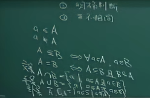
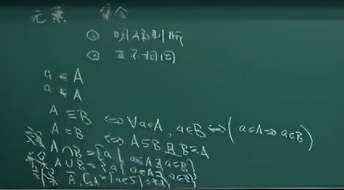
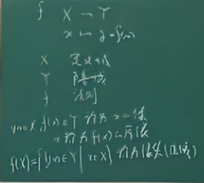
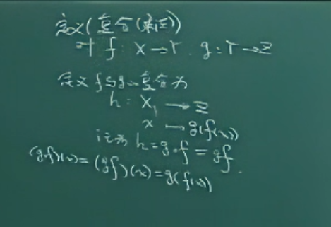

### 一、线性代数 00:06

#### 1.预备知识

##### 1) 逻辑

线性代数是基础课程，内容难度较低，初中生即可学习。二元一次方程组（如鸡兔同笼问题）属于线性代数范畴。学习线性代数需投入时间： 

- 每周15小时：可深入掌握并应用于科研 
- 每周10小时：可应对考试要求 
- 少于10小时：可能因习题偏难怪题影响成绩 

线性代数与微积分均为理工科必修数学课程，其重要性体现在： 

- 计算机科学基础：现代计算依赖线性代数理论 
- 学科成熟度：知识体系完整，教学资源丰富 
- 考试特点：需通过适量练习掌握解题技巧 
- 命题 10:30

# 预备知识

## 1.逻辑和几何

1. 逻辑与命题的引入 

数学逻辑的核心在于建立命题间的关联性，避免直接使用因果关系表述。逻辑体系构建有两种途径： 

- 集合论语言：通过集合关系定义逻辑关联 
- 统计学方法：仅描述事件间的强相关性 

2. 命题的定义与分类 12:42

命题需满足以下条件： 

- 必须是陈述句 
- 可明确判断真假 
- 分为真命题（成立）与假命题（不成立）非命题示例： 
  - 理发师悖论 
  - 自指语句（如"本句为假"） 

3. 命题的连接 14:29

命题可通过逻辑连接词组合，常见形式为"若 $A$ 则 $B$" ($A \to B$)。 

条件命题 "$A \to B$" 的真值表： 

| $A$ 真值 | $B$ 真值 | $A \to B$ 真值 |
| :---: | :---: | :-----: |
| 真    | 真    | 真      |
| 真    | 假    | 假      |
| 假    | 真    | 真      |
| 假    | 假    | 真      |

特殊情况说明：当 $A$ 为假命题时，无论 $B$ 真值如何，"$A \to B$" 恒为真命题。

- 命题的“且或非”连接及真假判断 17:43
- 命题连接方式： 
  - 且 ($a \land b$)：当 $a$ 和 $b$ 均为真命题时，结果为真；若其中任一为假，则结果为假。 
  - 或 ($a \lor b$)：当 $a$ 和 $b$ 中至少有一个为真时，结果为真；仅当两者均为假时，结果为假。 
  - 非 ($\neg a$)：对命题 $a$ 的否定，需明确否定的具体内容（如“太阳不每天东升西落”可能包含多种情况）。 
- 命题覆盖性： 
  - $a \lor b$ 的命题允许 $a$ 和 $b$ 存在逻辑重叠（例如“正方形是矩形或菱形”）。 
- 命题的简单记号与充分必要条件 19:36
- 逻辑记号： 
  - 若 $a$ 则 $b$ 记为 $a \to b$；$a \land b$ 记为 $a \land b$；$a \lor b$ 记为 $a \lor b$；非 $a$ 记为 $\neg a$。 
- 充分必要条件： 
  - 充分条件：若 $a \to b$ 成立，则 $a$ 是 $b$ 的充分条件（$a$ 成立可保证 $b$ 成立）。 
  - 必要条件：若 $a \to b$ 成立，则 $b$ 是 $a$ 的必要条件（$b$ 不成立时 $a$ 必不成立）。 
  - 等价条件：若 $a \to b$ 且 $b \to a$，则 $a$ 与 $b$ 互为充分必要条件（内涵完全一致）。 
- 命题的等价条件与量词引入 22:10
- 等价条件示例： 
  - “张三是十个人中最高的”等价于“张三比其他九个人都高”或“九个人比张三矮”。 
- 复合命题：命题可嵌套组合（如 $a$ 为 $b \lor c$，$b$ 为 $\neg a$）。 

- 量词作用：用于解决命题中“所有”或“存在”的表述问题（如“所有矩形是正方形”需量化判断）。 
- 量词 24:32

| 量词类型 | 记号 | 含义         | 示例                  |
| :------: | :--: | :----------: | :-------------------: |
| 存在量词 | $\exists$    | 至少存在一个 | $\exists$ 矩形是正方形（正确） |
| 全称量词 | $\forall$    | 所有 / 每一个 | $\forall$ 矩形是正方形（错误） |

集合 26:42

- 集合定义：由**互不相同的元素**组成的整体，且需满足**明确判断标准**（任意元素是否属于集合可明确判定）。 
  - 明确的判断
  - 互不相同
- 集合合法性：若存在无法判断归属的元素，则该整体不构成集合。 

- 元素和集合的关系 29:29

- 元素归属： 
  - $a \in A$ 表示元素 $a$ 属于集合 $A$；$a \notin A$ 表示 $a$ 不属于 $A$。 

- 子集生成：从集合中选取部分元素可构成子集。 

- 集合和集合的关系 30:02

- 集合关系： 
  - 包含 ($A \subseteq B$)：$A$ 的所有元素均属于 $B$。 
  - 相等 ($A = B$)：$A \subseteq B$ 且 $B \subseteq A$。 

- 集合运算： 

  

  - 交集 ($A \cap B$)：元素同时属于 $A$ 和 $B$。
  - 并集 ($A \cup B$)：元素属于 $A$ 或 $B$。 
  - 补集 ($A^c$)：全集中不属于 $A$ 的元素。 

- 逻辑对应： 
  - 集合运算与命题逻辑一一对应（如 $\cap$ 对应 $\land$，$\cup$ 对应 $\lor$，补集对应 $\neg$）。 

  - 条件转化：数学中因果关系通过集合包含关系表达（如 $a \to b$ 对应 $A \subseteq B$）。

    

数集 38:38

数集包括以下类型： 

- 自然数集 ($\mathbb{N}$)：从零开始的正整数序列 
- 整数集 ($\mathbb{Z}$)：包含负整数、零和正整数 
- 有理数集 ($\mathbb{Q}$)：可表示为 $\dfrac p q$ 形式 ($p, q \in \mathbb Z$ 且 $q \neq 0$) 
- 实数集 ($\mathbb{R}$)：包含有理数和无理数，需通过微积分严格定义 
- 复数集 ($\mathbb{C}$)：形式为 $a + bi$ ($a, b$ 为实数，$i$ 为虚数单位) 

集合元素不仅限于数值，还可包含混合类型数据（如学号、身高、体重等）。集合的子集本身也可能是集合。 

## 2.证明法 41:26

- 直接证明法 41:32

直接证明法通过逻辑链建立命题与条件的关系，主要分为两种策略： 

- 逆向溯源法：从结论反推所需条件，逐步验证是否与已知条件匹配 
- 正向推导法：从已知条件出发，逐步推导至目标结论 

重点：该方法在初中平面几何中曾为核心训练内容，现教学重点已转向间接证明法。 

间接证明法 42:55

(1) 反证法 43:03

反证法的核心步骤： 

- 假设命题不成立 
- 推导出与已知事实矛盾的结论 
- 反证原假设错误，命题得证 

经典案例：证明 $\sqrt{2}$ 为无理数 

- 假设 $\sqrt{2}$ 为有理数（可表示为最简分数 $p/q$） 
- 推导出 $p, q$ 均为偶数，与"最简分数"矛盾 
- 关键点：矛盾表明初始假设错误 

优势：通过增加假设条件扩展推导空间。 

(2) 数学归纳法 49:43

数学归纳法适用于自然数变量命题，分为两类： 

|    类型    |                             步骤                             |   适用范围   |
| :--------: | :----------------------------------------------------------: | :----------: |
| 第一归纳法 |  验证 $n=1$ 成立 —— 假设 $n=k$ 成立 $\to$ 证明 $n=k+1$ 成立  | 线性递推关系 |
| 第二归纳法 | 验证 $n=1$ 至 $k_0$ 成立 —— 假设 $n \le k$ 成立 $\to$ 证明 $n=k+1$ 成立 | 多步依赖关系 |

示例：证明 $1+2+\dots+n = \dfrac{n(n+1)}{2}$ 

- 基础步：$n=1$ 时等式成立 
- 归纳步：假设 $n=k$ 成立，推导 $n=k+1$ 时等式仍成立 

扩展应用：可通过嵌套归纳处理有理数证明，但实数证明需更高级工具（集合论超限归纳法）。

## 3.映射 57:57

映射是**集合**之间的关系，区别于集合的子集或交集关系。映射通过特定法则建立集合间的对应关系。

定义需明确：给定集合 $X$ 和 $Y$，若对 $X$ 中任意元素 $x$，存在 $Y$ 中唯一元素 $y$ 与之对应，则称该对应关系为 $X$ 到 $Y$ 的映射。

关键特征在于"唯一对应性"，即一对一或多对一关系属于映射，而一对多或多对多不属于映射。

- 映射定义 58:36

映射的数学表示为 

$$
f: X \to Y，\\
x \mapsto  y = f(x)
$$
其中：

- $X$ 为定义域 
- $Y$ 为陪域 
- $f$ 为对应法则 
- $f(x) \in y$ 称为 $x$ 的像 
- $x$ 称为 $f(x)$ 的原像 
- 像集（值域）记作 $f(X)$，定义为 $\{f(x)\in Y \mid x \in X\}$。

- 恒等映射是最简单的映射实例，满足 $f(x) = x$。映射的存在性与无穷性可通过自然数集上的线性映射（如 $f(x) = 2x$）验证。

映射相等 01:06:07

判定映射相等的三个要件： 

- 定义域相同 -  陪域相同 -  对应法则相同

- 典型反例：$\sin x$ 在 $[0, 1] \to [0, 1]$ 与 $[0, 1] \to \mathbb{R}$ 的映射因陪域不同而不相等。

  

  

单射 01:07:32

单射（一对一映射）的定义：$\forall x_1, x_2 \in X$，若 $f(x_1) = f(x_2)$ ，则 $x_1 = x_2$。本质特征为像的唯一原像性。

- 满射 01:07:47

满射的定义：$\forall y \in Y$，$\exists x \in X$ 使 $f(x) = y$。等价表述为值域等于陪域。

- 双射 01:08:20

双射的定义：同时满足单射与满射。数学表述为既满足原像唯一性，又满足陪域覆盖性。

- 可逆的 01:09:05

可逆映射的充要条件为双射。逆映射 $f^{-1}: Y \to X$ 的定义要求严格满足 $f^{-1}(f(x)) = x$。

作业内容：教材 - 2节1-4题， - 3节1-3题及5、8-10题。

