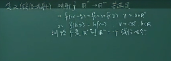

### 一、桥受力分析 23:11

桥的受力分析模型中，桥面承受一个集中荷载 $F$（如行人重量），由两个桥墩提供支撑力 $f_1$ 和 $f_2$。桥墩支撑力受地基土壤性质限制，当荷载超过土壤承载力时，桥墩可能下陷导致结构失效。土木工程中桥墩需建于基岩，若地基为软土则需计算最大允许荷载，其临界值由桥墩与土壤的摩擦力决定。 

#### 1.力学模型简单的情况 25:33

力学模型简化条件： 

- 荷载 $F$ 作用位置：距左桥墩 $l_1$，距右桥墩 $l_2$，桥总长 $L=l_1+l_2$ 
- 平衡条件：桥面静止需满足合力为零（$f_1+f_2=F$）与合力矩为零（绕任意支点力矩平衡） 

##### 1) 桥面受力平衡与杠杆原理 26:57

平衡方程推导： 

- 力平衡：$f_1 + f_2 = F$ 

- 力矩平衡（以左桥墩为支点）：$F \times l_1 = f_2 \times L$ 

- 力矩平衡（以右桥墩为支点）：$F \times l_2 = f_1 \times L$ 

  杠杆原理：动力矩（$F \times l_1$）等于阻力矩（$f_2 \times L$），保证桥面无旋转。 

##### 2) 方程的解与验证 29:09

方程解： 

- $f_2 = \dfrac{l_1}{L} \times F$ 
- $f_1 = \dfrac{l_2}{L} \times F$

验证：解满足所有可能的力矩平衡方程（如绕桥面任意点），证明解的唯一性。 

##### 3) 映射与向量的定义 30:32

荷载-支撑力映射关系： 

- 定义域：$F \in \mathbb{R}$（可正可负，代表压力或拉力） 
- 像空间：输出为列向量 $\begin{pmatrix} f_1 \\ f_2 \end{pmatrix}$，需引入向量概念描述二者耦合关系。 

#### 2.定义向量 32:54

##### 1) 向量的基本定义 33:00

$m$ 维向量定义为由 $m$ 个有序实数 $x_1, x_2, \ldots, x_m$ 组成的数组，在线性代数中常表示为**列向量**：$\begin{pmatrix} x_1 \\ x_2 \\ \vdots \\ x_m \end{pmatrix}$
其中实数 $x_i$ 称为该向量的第 $i$ 个分量。 

##### 2) 向量相等的条件 34:04

向量相等的充要条件为所有对应分量相等。 

##### 3) 向量集合的定义 36:03

向量空间：所有 $m$ 维实向量构成集合 $\mathbb{R}^m$，推广至复数则为 $\mathbb{C}^m$。应用示例：桥墩支撑力 $\begin{pmatrix} f_1 \\ f_2 \end{pmatrix} \in \mathbb{R}^2$。

##### 4) 例题1：向量映射的性质 38:50

- 向量映射的可加性：两个输入向量分别映射后的输出之和等于两个输入向量相加后的映射结果。 
- 向量映射的齐次性：输入向量放大 $k$ 倍后映射的输出等于原映射输出放大 $k$ 倍的结果。 

#### 3.叠加原理 40:02

叠加原理包含两条性质： 

- 可加性：输入向量的和映射后等于各自映射结果的叠加。 
- 齐次性：输入向量缩放后映射结果同步缩放。 

##### 1) 可加性 40:14

可加性定义为：两个输入向量分别映射后的输出之和等于两个输入向量相加后的映射结果。 

##### 2) 齐次性 40:32

齐次性定义为：输入向量缩放 $k$ 倍后映射的输出等于原映射输出缩放 $k$ 倍的结果。叠加原理广泛存在于物理现象中，如电路中的电流与电压关系、水波的叠加等。 

#### 4.定义向量的运算 42:39

##### 1) 数乘定义

向量加法定义：两个 $m$ 维向量相加结果为对应分量相加：
$$  \begin{pmatrix} x_1 \\ \vdots \\ x_m \end{pmatrix}+ \begin{pmatrix} y_1 \\ \vdots \\ y_m \end{pmatrix} = \begin{pmatrix} x_1 + y_1 \\ \vdots \\ x_m + y_m \end{pmatrix} $$

##### 2) 数乘和加法 43:44

- 数乘运算定义：向量缩放 $k$ 倍结果为 $k \begin{pmatrix} x_1 \\ \vdots \\ x_m \end{pmatrix} = \begin{pmatrix} kx_1 \\ \vdots \\ kx_m \end{pmatrix}$。 
- **线性运算**：加法与数乘统称为线性运算，需在可执行这两种运算的集合（如$\mathbb{R}^m$）中定义。 

#### 5.带有线性运算的集合 45:51

线性空间指定义了加法和数乘运算的集合（如 $\mathbb{R}^m$ ），其元素需满足线性运算封闭性。 

##### 1) 线性空间 46:04

线性空间隐含运算能力：集合中的任意向量均可执行加法和数乘操作。映射的定义域与陪域需为线性空间（如 $\mathbb{R}^1$ 到 $\mathbb{R}^2$ ）。 

#### 6.向量的运算法则 48:23

向量线性运算满足以下八条法则： 

$\forall a,b,c \in \mathbb{R}^m,\qquad k, l \in \mathbb R$

- 加法结合律：$(a+b)+c=a+(b+c)$ 
- 加法交换律：$a+b=b+a$ 
- 零向量存在性：存在全零向量 $0$ 使得 $a+0=a$ 
- 负向量存在性：对任意向量 $a$，存在 $-a$ 满足 $a+(-a)=0$ 
- 数乘结合律：$k(la)=(kl)a$ 
- 单位数乘：$1a=a$ 
- 第一分配律：$(k+l)a=ka+la$ 
- 第二分配律：$k(a+b)=ka+kb$ 

##### 1) 向量常用表示法 49:27

向量表示法： 

- 箭头标记（如 $\vec{a}$ ）或加粗字体（如 $\mathbf{a}$ ），但线性代数中通常省略标记，默认字母为向量。 
- 物理学科中向量必须明确标注（箭头或加粗），而数学中可简化表示。

#### 7.线性映射的定义 58:14

线性映射是指从 $\mathbb{R}^n \to \mathbb{R}^m$ 的映射 $f$，需满足以下两个条件： 

- $f(x+y) = f(x) + f(y)$（保持加法） ，

- $f(kx) = kf(x)$（保持数乘），其中 $x$、$y$ 为定义域中的任意向量，$k$ 为任意实数。

  满足上述条件的映射称为线性映射。 

##### 1) 线性映射存在性 59:37

线性映射的存在性可通过构造验证。例如，从 $\mathbb{R}^n$ 到 $\mathbb{R}^m$ 的线性映射可通过 $m$ 个线性方程定义，且存在无穷多个可能的线性映射。 

##### 2) 线性映射相等性 01:00:23

两个线性映射相等的充要条件是作为映射相等。验证线性映射的性质可通过以下等价条件简化： 

- $f(kx+ly) = kf(x) + lf(y)$（对任意向量 $x, y$ 和实数 $k, l$ 成立）。 

#### 8.线性映射的理解 01:02:11

##### 1) 线性映射的基本概念 01:02:14

线性映射的核心特征是保持线性运算： 

- 加法保持：定义域中的加法运算通过 $f$ 映射为陪域中的加法运算。 
- 数乘保持：定义域中的数乘运算通过 $f$ 映射为陪域中的数乘运算。线性映射的本质是将定义域的线性结构传递到陪域。 

##### 2) 线性映射与线性运算的关系 01:04:04

线性映射的定义可概括为保持线性运算的映射，其重要性体现在： 

- 线性代数的核心研究对象是**线性空间**与**线性映射**。 
- 线性映射是连接不同线性空间的工具，贯穿整个学科体系。 

##### 3) 线性映射在线性代数中的重要性 01:05:20

线性代数的本质是研究线性空间和线性映射。具体表现为： 

- 线性映射是构建线性代数理论的基础，如矩阵、行列式等概念均由其衍生。 
- 实际应用中需熟练掌握线性映射的性质，例如在计算机图形学、数据分析等领域。 

##### 4) 例题1: 旋转映射是否为线性映射 01:09:38

以平面旋转映射为例，验证其线性性： 

- 旋转映射的表达式： 
  - 输入向量 $\begin{pmatrix} x \\ y \end{pmatrix}$ 旋转 $\theta$ 角后输出为 $\begin{pmatrix} x\cos\theta - y\sin\theta \\ x\sin\theta + y\cos\theta \end{pmatrix}$。 
- 验证线性性： 
  - 需证明旋转映射满足 $f(kx+ly) = kf(x) + lf(y)$（过程略）。结论：旋转映射是线性映射，因其严格保持线性运算。

### 二、作业 01:16:51