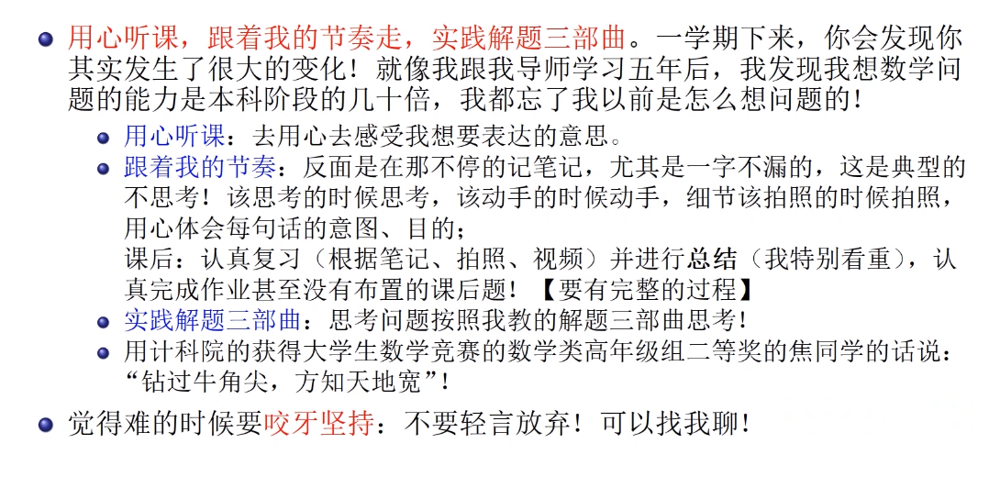
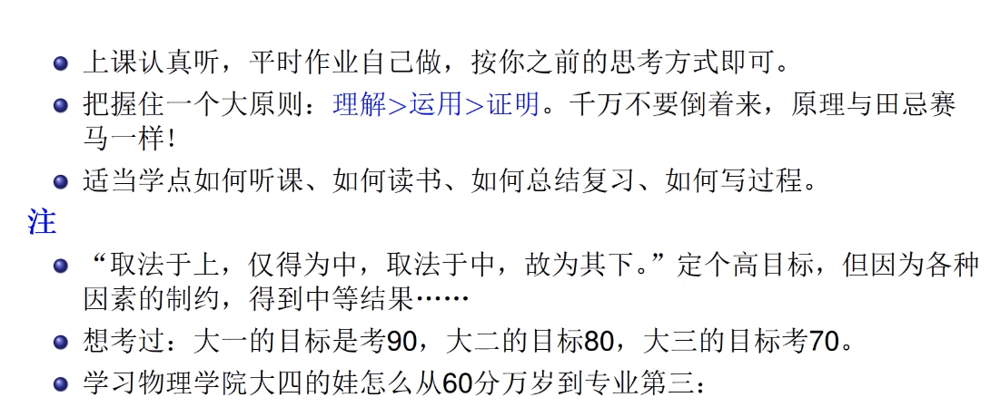

#### 3.建议 08:10

##### 1) 学方法、竞赛、打基础 15:07

- 建议：学方法、竞赛、打基础 15:10

  

学习建议分为三类： 

- 学方法、竞赛、打基础： 
  - 核心要求：用心听课，跟随教学节奏，实践解题三部曲。 
  - 长期效果：坚持一学期后，数学认知与解题能力将显著提升。 
  - 教师背景佐证：本科阶段以专业第二名保送中科院，博士阶段思维能力的提升达几十倍，验证方法论的有效性。 

- 用心听课，跟着节奏走 17:12

听课要点： 

- 理解意图优先：关注教师表达的目的而非字面意思，结合上下文理解内容。 
- 避免机械记录：反对逐字记笔记的“节能模式”，强调主动思考与课堂互动。 
- 节奏匹配： 
  - 正面行为：按教师指令思考或动手，课下补足细节。 
  - 反面案例：过度记录导致脱离课堂节奏，理解碎片化。 
- 方法论独特性：教学内容基于独立思考和个性化理解，需通过体会意图内化为自身能力。 

- 课后复习与总结 20:21

课后学习要求： 

- 禁止预习：预习会干扰思维方法的习得，强调直接通过课堂吸收新内容。 
- 复习与总结： 
  - 必做项：整理笔记、视频资料，重点总结知识点。 
  - 效果保障：扎实的知识基础结合解题三部曲，可覆盖绝大多数题目（包括大学生数学竞赛难度）。 
- 能力分层： 
  - 总结能力较易掌握，需投入时间； 
  - 解题思维训练难度较高，需逐步内化。 
- 认真完成作业，实践解题三部曲 22:47

作业与思维训练： 

- 作业要求： 
  - 主动拓展练习范围，书写完整解题过程（避免师大常见的过程缺失问题）。 
  - 通过解题实践巩固解题三部曲。 
- 能力提升案例： 
  - 学生通过方法学习后，数学分析与后续课程衔接能力显著优于高等代数。 
  - 非数学类竞赛获奖者转战数学类高年级组仍获二等奖，验证方法普适性。 
- 难度预警：数学分析初期极限概念为难点，需坚持突破。 
- 坚持与寻求帮助 27:01

学习态度支持： 

- 坚持必要性：初期困难需克服，教师可提供个性化建议（参考教师自身成长经历）。 
- 资源开放：教师愿分享经验，助力学生突破瓶颈。 

##### 学习原则

- 理解、运用与证明的顺序 28:34

学习优先级调整： 

| 阶段 |       核心目标       |         常见误区         |       调整策略       |
| :--: | :------------------: | :----------------------: | :------------------: |
| 理解 |     掌握概念本质     |       直接跳入证明       |     先理解后运用     |
| 运用 |       实践解题       |     未理解即套用公式     |   通过应用加深理解   |
| 证明 | 理论推导（后期重点） | 过早投入复杂证明消耗精力 | 田忌赛马式优先级调整 |

关键原则：理解 ＞ 运用 ＞ 证明，顺序优化可显著改善学习体验。

- 提升学习效率的方法 30:45

掌握听课技巧、阅读方法、总结归纳能力以及解题过程书写规范可有效提升学习效率。这些方法相比解题技巧更易掌握，投入时间较少但能显著提高成绩表现。

- 设定目标的原则 31:19

目标设定应遵循高标准原则：设定较高目标可能达成中等结果，设定中等目标可能达成较低结果，而设定过低目标可能导致无法达成。建议学业目标设定：

- 大一阶段：以90分为目标，实际可能达到80分
- 大二阶段：以80分为目标，实际可能达到70分
- 大三阶段：以70分为目标，实际可能达到60分（及格线）
- 从60分到专业第三的转变 32:41

学业提升的核心在于态度转变：

- 严谨态度：对专业学习和生活事务保持认真严谨的处事原则
- 过程导向：注重能力提升而非结果，成绩仅是能力提升的副产品
- 持续积累：通过细节行为的长期坚持可实现从及格线到专业前列的跨越关键转变要素在于将关注点从成绩结果转移到学习过程本身的能力培养。