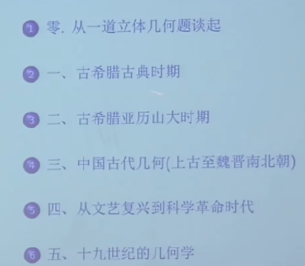
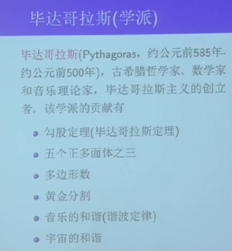
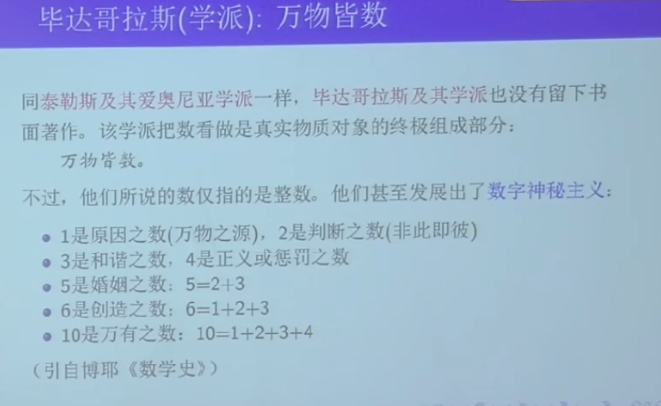

### 一、几何学基础 02:53

[课程主页](http://staff.ustc.edu.cn/~wangzuoq/Courses/22F-Geometry/index.html)

几何学基础课程是科大课程改革的产物，由两位教授主导设计。该课程首次面向一年级学生开设，旨在通过改革后的教学体系使学生获得更多几何学思想层面的收获。 

#### 2.课程改革 09:47

##### 1) 几何学基础课程改革的背景与介绍

几何学基础与代数学基础为对应课程，前者为近两年新设改革课程，旨在重构传统解析几何教学体系。 

##### 2) 原《解几》课程的内容与问题 10:15

- 传统模式：源自前苏联教学体系，侧重解析几何计算技巧 
- 主要问题： 
  - 思想性缺失：过度依赖坐标变换与方程求解 
  - 实用性矛盾：数学系学生计算能力薄弱，课程负担重 
  - 课程定位：与高中解析几何内容重复性较高 

##### 3) 改革的目标与方向 11:58

- 内容优化： 
  - 弱化纯计算内容（如二次曲面参数化） 
  - 引入线性代数工具简化推导 
- 思想强化： 
  - 突出几何直观与公理化思维 
  - 补充非欧几何等现代几何学概念 

##### 4) 改革遇到的困难与解决思路 15:32

|      争议焦点      |              改革对策              |
| :----------------: | :--------------------------------: |
|  新生课业压力过大  |    控制习题难度梯度，设置选做题    |
| 几何课程体系不完整 | 增加思想史脉络，强化与后续课程衔接 |
|   教师适应性不足   |  采用渐进式改革，保留核心计算模块  |

##### 5) 课程理念与习题设计 17:46

- 教学定位：通过专题式习题（如拓扑初步、射影几何构造）拓展课堂内容 
- 考核原则：不强制完成所有习题，重点考察几何思想的理解与应用能力

##### 6) 课程的基本功能与配合 18:29

课程保留线性代数课程的基本功能，包括空间中的线性变换及其对应的线性代数内容。同时加强几何历史发展概念的讲解。课程重点介绍对称性，从几何最初作为形的理论逐步发展为理解对称的工具，最终引入爱尔兰钢纲领的核心思想。课程注重与代数学基础的配合，直接使用群等概念，并包含后续几何课程的起源性内容。 

#### 3.课程内容 19:52

##### 1) （起）几何与公理化：公理化的形成、演化与完善 19:59

课程从几何公理化的历史讲起，介绍欧几里得公理体系到希尔伯特公理体系的演化过程。 

##### 2) （承）欧氏几何：向量空间、刚体变换与图形分类 20:26

课程主要内容分为两大模块： 

- 欧氏几何：包括向量理论、向量运算，以及从希尔伯特公理体系推导向量空间理论的方法，进而引入变换理论和曲面分类。 
- 射影几何：作为后续重点内容。 

##### 3) （转）几何与对称：埃尔朗几何纲领核心思想 21:06

对称性是几何的核心概念： 

- 全等变换与相似变换对应不同的几何类型，其对称群大小不同。 
- 最大对称性问题导向射影几何的研究。 

##### 4)（合） 射影几何：射影平面、射影变换与重要定理 21:56

从对称性角度介绍射影几何的基本框架，包括射影平面和射影变换的初步内容。 

##### 5) （展望）拓扑空间与拓扑变换：基本研究对象与拓扑不变量 22:07

简要讨论拓扑学的基本思想： 

- 橡皮泥几何的特征是放弃直线等刚性概念。 
- 研究拓扑不变量作为核心工具。 

#### 4.几何简史 23:29

零、从一道立体几何题谈起
一、古希腊古典时期
二、古带腊业历山大财期
三、中国古代几何（上古至魏晋南北朝）
四、从文艺复兴到科学革命时代
五、十九世纪的几何学

课程聚焦20世纪前的几何发展史，分为多个阶段讲解。 

##### 1) 一道立体几何题 24:28

- 例题1:四棱台体积计算及历史背景以边长为 $2$ 和 $4$ 的正方形为底面、高为 $6$ 的四棱台体积计算为例，引出公元前1850年埃及《莫斯科纸草书》中记载的数学内容，其体积公式为：$V = \dfrac{h}{3}(a^2 + ab + b^2)$
- 例题 1 解答：四棱台体积公式推导 26:05

古埃及人通过分步计算（底面积、上下底乘积、高与系数的结合）得到体积结果 $56$，该算法与金字塔建造中的石料估算需求相关。 

- 古埃及人计算四棱台体积的原因 27:53

四棱台体积公式的实用背景源于尼罗河洪水后土地重新划分与赋税计算的需求，但早期方法多为经验性近似。 

##### 2) 古埃及的几何 28:51

古埃及几何的发展与尼罗河泛滥直接相关： 

- 土地测量和赋税公平性催生面积计算技术。 
- 存在错误公式（如四边形面积的对边平均乘积法），反映早期几何的实用性倾向。 

##### 3) 几何的起源 30:15

|   文明   |      几何特征      |  载体  |      局限性      |
| :------: | :----------------: | :----: | :--------------: |
|  古埃及  | 土地测量与面积计算 | 纸草书 | 公式多为经验近似 |
| 古巴比伦 | 简单图形面积与体积 |  泥板  | 圆锥体积公式错误 |

##### 4) 古巴比伦的几何 32:07

- 古巴比伦几何学基础：泥板与图形计算 32:09

古巴比伦通过泥板记录掌握长方形、直角三角形等图形的面积计算，但对复杂体积（如圆锥）使用错误公式。 

- 例题1：古巴比伦泥板“Plimpton 322” 32:46

Plimpton 322泥板记载了复杂的勾股数组（如 $3367, 3456, 4825$），其推导方法至今存疑，可能涉及早期勾股定理或三角函数知识。

- 史前几何的特征与总结 34:22

古巴比伦几何的特征可总结为以下几点： 

- 史前几何问题均源于具体实际问题，尚未形成抽象的形状概念。 
- 缺乏抽象几何图形定义，例如“长方形”仅指代具体田地的边界，而非通用几何图形。 
- 公式与结论基于经验归纳，无逻辑推导过程，例如面积计算仅依赖经验数值，无需理解原理。 
- 数学工具仅服务于实用目的，如土地测量，未形成理论体系。推荐阅读《古今数学思想》以深入了解该阶段数学发展。 

##### 5) M.克莱因的评价 36:02

- M.克莱因对古埃及和古巴比伦文明的评价 36:04

|    文明类型     |        特征        |           数学贡献           |       局限性       |
| :-------------: | :----------------: | :--------------------------: | :----------------: |
| 古埃及/古巴比伦 | 经验主导，实用性强 | 开创数学源头（如测量、公式） | 缺乏抽象与逻辑推导 |
|     古希腊      |  理论化，逻辑证明  | 建立数学体系（如公理化几何） |  脱离具体应用场景  |

核心观点：古埃及与古巴比伦数学虽具开创性，但仅相当于“粗糙的木匠工艺”，而古希腊数学则发展为“系统的建筑学”。需辩证看待其历史地位——既不可过度夸大，亦不应完全否定其基础作用。 

- 古希腊文明：古典时期与泰勒斯 37:10

古希腊古典时期的数学特征如下： 

- 泰勒斯的历史地位： 
  - 西方首位有记载的思想家与哲学家，提出“水是万物之源”的哲学命题。 
  - 哲学思维的开端：首次追问世界运行规律，区别于古埃及的宗教性解释。 
- 数学贡献： 
  - 引入逻辑证明，如证明半圆内接角为直角（泰勒斯定理）。 
  - 几何学系统化奠基人，定义“几何”（geometry）一词源于“地球测量”的古希腊语组合。 
- 泰勒斯：哲学、科学与数学的奠基人 38:33

泰勒斯的贡献可归纳为三方面： 

- 哲学层面： 
  - 强调思考过程重于结论，其“水是万物之源”的命题意义在于提问方式而非答案本身。 
- 科学层面： 
  - 通过观察与理性解释自然现象，被誉为“科学之父”。 
- 数学层面： 
  - 首创逻辑证明方法，如证明等腰三角形底角相等、对顶角相等等基础几何定理。 
- 泰勒斯定理与几何学的起源 39:20

泰勒斯定理的核心内容与影响： 

- 定理内容：半圆的内接角为直角，此为数学史上首个严格证明的定理。 
- 术语起源： 
  - “几何”（geometry）词源：结合古希腊语“地球”与“测量”，反映早期几何的实用背景。 
  - 中文译名演变：明代徐光启译《几何原本》时借用“几何”（原义“多少”）代指形状研究，20世纪后逐渐取代“形学”成为通用术语。 
- 应用实例：利用相似三角形原理测量金字塔高度，体现理论结合实践的特点。

##### 6) 欧几里得 01:15:04

欧几里得在逻辑体系中建立了完整的几何学框架。作为几何学奠基人，其贡献在于首次系统整合了零散的几何学命题。

- 几何原本 01:15:17

《几何原本》是历史上最早的教科书之一，其英文原名"Elements"不含几何学专名，中文译名源自徐光启的翻译传统。该书共13卷，其中第14卷为后世伪作。

- 关于几何原本 01:15:57

《几何原本》发行量仅次于《圣经》，现存版本多为法国数学家勒让德的修订版。该书内容结构如下：

- 前六卷：初等平面几何，第五卷专述比例理论
- 第七至九卷：数论基础，包含素数无限性的证明
- 第十卷：无理数分类，研究可尺规作图的无理数类型
- 最后三卷：立体几何

欧几里得的主要贡献在于：

- 公理体系选择：确立400余命题的证明顺序与逻辑起点
- 存在性证明原则：仅包含可构造对象（如尺规作图），回避三等分角等不可证命题
- 几何代数特征：所有运算均通过几何量实现，避免纯数值计算
- 平行公设 01:19:51

|      公设表述方式      | 数学本质           | 历史影响             |
| :--------------------: | ------------------ | -------------------- |
|  采用有限相交条件叙述  | 等价于平行线唯一性 | 避免涉及无穷概念     |
| 延迟至命题29才首次使用 | 反映公设的非自明性 | 引发非欧几何研究     |
|     内角和判定准则     | 隐含空间弯曲可能性 | 为相对论奠定数学基础 |

- 阿波罗尼奥斯 01:22:27

阿波罗尼奥斯的贡献包括：

- 《圆锥曲线论》系统研究椭圆、抛物线、双曲线
- 发现双曲线双分支特性
- 建立准坐标系方法，为解析几何雏形但仍属几何代数范畴
- 阿基米德 01:23:51

阿基米德的数学成就：

- 穷竭法求面积体积，计算圆周率近似值
- 物理数学结合：先用力学方法猜想结果，再用反证法严格证明
- 球体公式：证明球体积等于外切圆柱体积的 $2/3$，该结论刻于其墓碑
- 阿基米德公理：奠定实数完备性基础，指出对任意正数 $a, b$，存在 $n$ 使 $na > b$
- 帕普斯 01:26:49

亚历山大时期数学特点：

- 托勒密定理与梅涅劳斯定理主要应用于球面三角学
- 帕普斯定理成为射影几何重要基础：两直线上三点连线交点共线
- 数学实用化转向：天文学与航海需求推动三角学与数值计算发展
- 代数独立萌芽：算术运算逐渐脱离几何约束

#### 5.中国古代几何 01:30:16

中国古代几何具有辉煌成就，与古希腊时期相对应。 

##### 1) 规矩与墨子 01:30:35

- 规与矩：甲骨文中已有记载，规用于画圆，矩用于画直线，相传起源于伏羲时代。 
- 天圆地方观念：古代存在天圆地方的宇宙观，唐代绢画中可见规与矩的描绘。 
- 墨子的贡献： 
  - 身份与思想：墨子为平民科学家，主张兼爱非攻，擅长守城器械制造。 
  - 几何定义：墨经中定义了点（“端，体之无序而最前者也”）、线段相等、平行和圆等几何概念。 
  - 历史局限：秦始皇焚书坑儒后墨家学说衰落，加之中国古代更注重实用性，几何理论未进一步发展。 

##### 2) 《周髀算经》与勾股定理 01:33:05

- 成书时间：部分内容可追溯至公元前60至90年，完整成书于公元前1世纪。 
- 内容特点：采用对话形式讨论直角三角形，用于测量日高等天文问题。 
- 勾股定理： 
  - 完整表述：“以日下为钩，日高为股，勾股各自乘，并而开方除之，得斜至日”，明确表述勾股定理。 
  - 误解澄清：并非仅限勾三股四弦五，而是普适性定理。 
  - 赵爽的证明：东汉赵爽在《周髀算经注》中给出一般性证明，并绘制弦图。 
- 国际命名：西方称毕达哥拉斯定理，中国称勾股定理，国际学术界认可两种命名。 

##### 3) 《九章算术》中的几何 01:36:17

- 成书时间：约公元1世纪，部分内容早至公元前3至2世纪。 
- 结构特点：以问答形式呈现246个问题，分九卷，其中三卷涉及几何： 
  - 方田卷：计算平面图形面积。 
  - 少广卷：已知面积反推边长。 
  - 商功卷：计算立体体积。 
  - 勾股卷：应用勾股定理，涉及二次方程。 
- 缺乏证明：书中仅提供问题解法，未给出理论证明。 

##### 4) 刘徽 01:37:59

- 贡献：为《九章算术》作注，建立完整数学体系并补充证明。 
- 中国古代几何特征： 
  - 实用性导向：为解决实际问题（如测量、工程）发展几何。 
  - 计算技术高超：发展出先进的计算方法。 
  - 证明形式：证明多见于注释（如刘徽注、赵爽注），而非原始文本。 

#### 6.小结 01:41:55