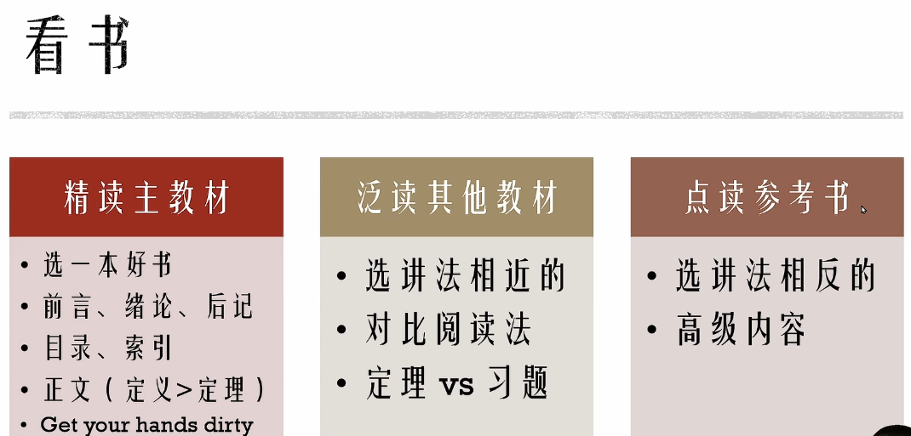
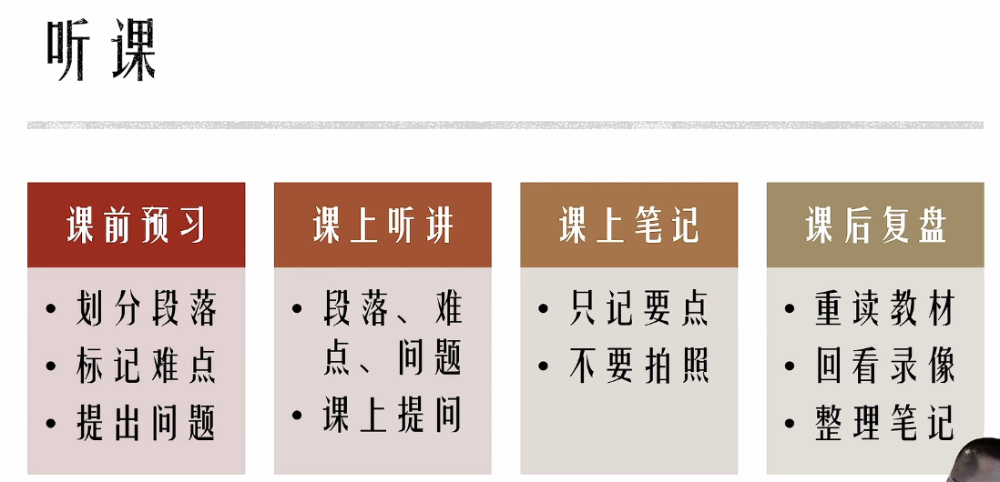
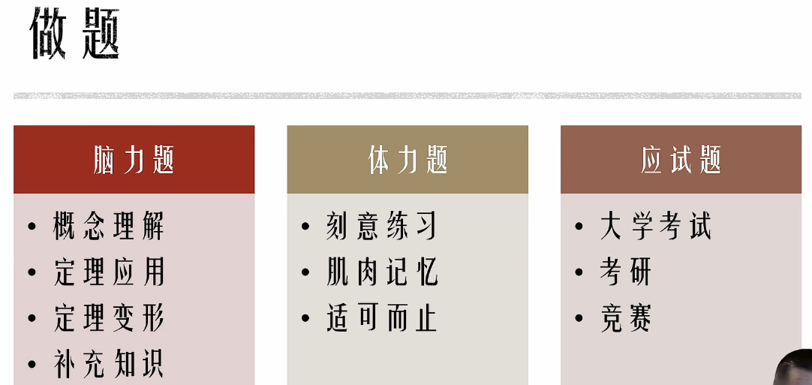
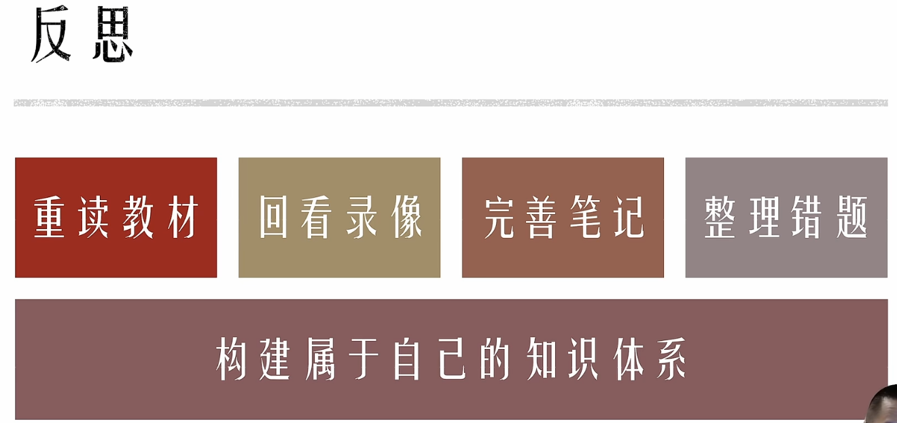
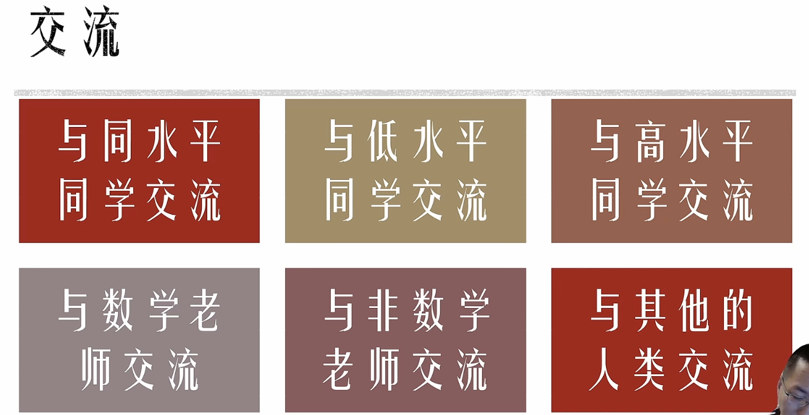
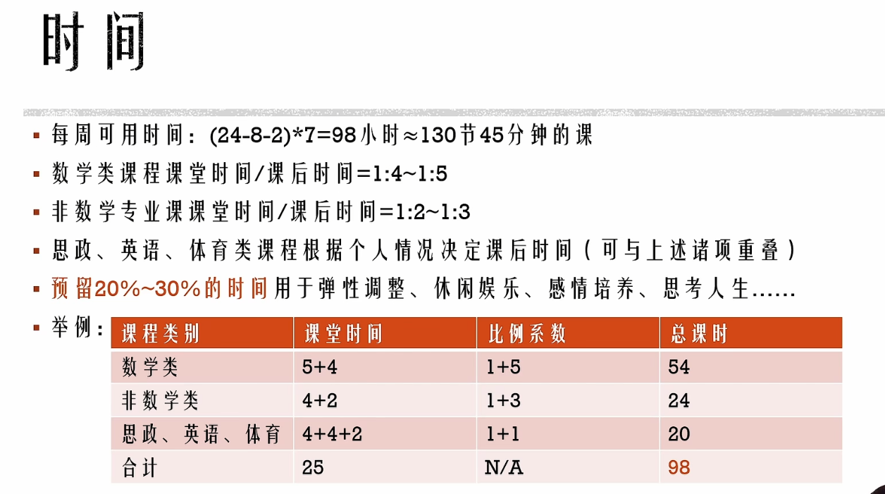
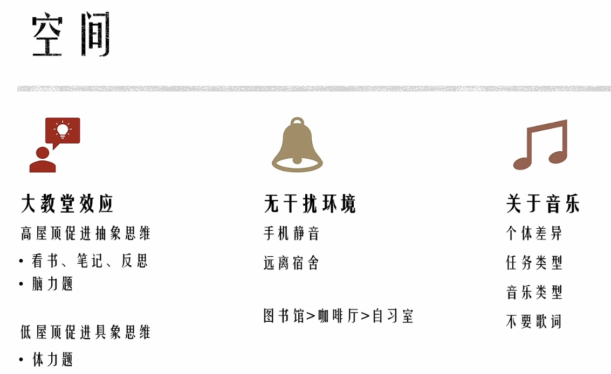
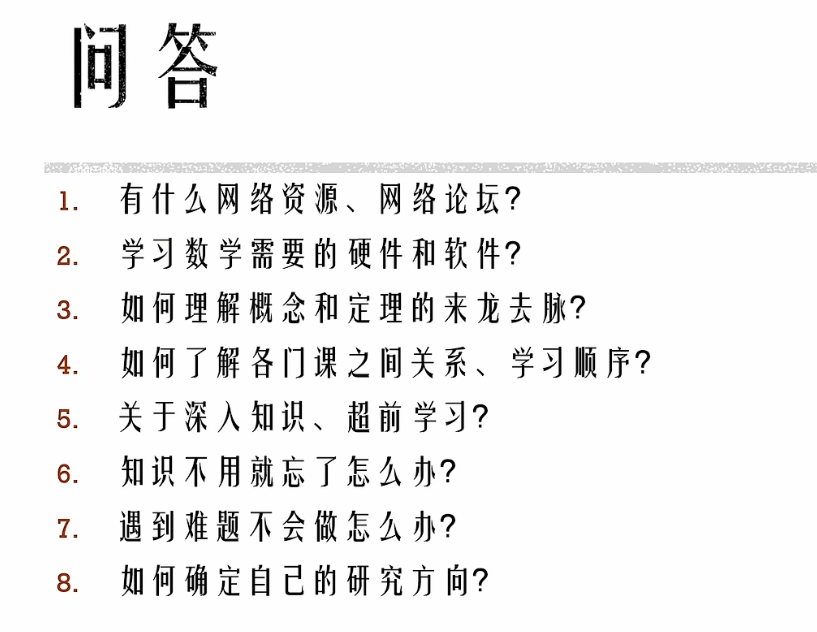

**构建知识体系框架**

# [大学数学通用学习方法](https://www.bilibili.com/video/BV1eM411Q7jz/?spm_id_from=333.337.search-card.all.click&vd_source=6cbf2d9376aac4728dde0f2089cbae13) 

## 1.看书 00:43

- 大学数学学习方法需从高中模式转变，尤其针对大一大二新生。 
- 主教材需精读，与高中依赖刷题不同，大学教材是核心学习资源。 
- 教材类型分为三类：主教材、其他类似教材、参考书，阅读方法各有侧重。 

### 1) 主教材 01:43

- 主教材选择需严谨，优先选用权威或课程指定教材。 
- 精读时需关注结构性内容： 
  - 前言、绪论、后记包含作者核心观点，需提前阅读。 
  - 目录需熟悉，以**构建知识体系框架**。 
  - 索引是快速定位概念的工具，类似字典检字表。 
- 正文阅读方法： 
  - 章节结构通常分为三部分：引言（问题背景）、定义与定理（理论工具）、应用（问题解决）。 
  - 定义比定理更重要，定义是数学思想的核心，需重点理解其来源与作用。 
  - 定理需关注证明过程，仅掌握结论无法深入理解。 
- 学习需动手实践： 
  - 草稿纸记录关键词与逻辑关系，辅助理解章节内容。 
  - 读书笔记应系统化，避免机械抄书，可通过语言转换（中英互译）强化理解。 
  - 抄书与复述是攻克难点的高效方法，但需结合主动思考。 

### 2) 其他教材 07:38

- 泛读需选择讲法相近的教材，避免逻辑体系差异过大增加学习负担。 
- 对比阅读法：比较主教材与其他教材对同一定理的阐述差异，深化理解。 
- 识别其他教材与主教材习题的关联，优先独立完成主教材习题，避免直接阅读答案。 
- 定理证明可先尝试自主推导，再对比教材方法，提升逻辑能力。 

### 3) 点读参考书 09:51

- 点读适用于特定难点，仅阅读高级教材中与课程相关的内容片段。 
- 通过不同路径理解同一概念，如行列式与线性方程组的不同引入方式。 
- 高级知识点无需系统学习，按需查阅抽象代数等工具书解决具体问题。 

## 2.听课 11:45

### 1) 课前预习 11:52

- 预习需划分章节结构，明确问题背景、定义定理、应用三部分。 
- 标记难点与疑问，便于课堂针对性听讲。 
- 提前提出问题，增强课堂互动效率。 

### 2) 课上听讲 12:50

- 80%注意力集中于理解内容，仅记录课前未掌握的要点。 
- 课堂提问可澄清共性问题，促进师生互动。 
- 避免拍照替代笔记，手写笔记更利于知识内化。 

### 3) 课后复盘 14:52

- 复盘需在当天完成，利用短期记忆强化长期记忆转化。 
- 重读教材与回看录像，补充课堂遗漏点。 
- 更新笔记，整合预习、课堂、复习三阶段的理解，形成完整知识链。

## 3.笔记 16:46

### 1) 笔记的可读性 16:52

笔记的**可读性**是首要原则，必须使用完整句子记录逻辑链条。数学学科的知识点具有长逻辑链条特征，需明确标注因果关系（如"因为...所以..."）或问题解决路径（如"为解决问题...需引入概念..."）。仅记录关键词会导致后期无法理解，记忆具有时效性，即使当时印象深刻的缩写或概括，三个月后可能完全遗忘。实证表明，日记中"最难忘的一天"若缺乏细节记录，20年后仍无法回忆具体事件。

### 2) 笔记的留白 18:04

笔记必须保留充足空白区域，康奈尔笔记法的留白比例仍不足。推荐采用单侧书写法（如仅使用B5/A5笔记本右半页），留白区域用于： 

- 修正错误内容 
- 补充新发现 
- 优化表述方式 
- 后期复习添加注释纸质成本远低于知识获取价值，适当留白可提升笔记的长期使用效率。

### 3) 笔记的手写与文具选择 19:59

手写笔记的核心优势与注意事项： 

|  对比维度  |      电子笔记      |        手写笔记         |
| :--------: | :----------------: | :---------------------: |
| 设备依赖性 |  存在设备损坏风险  |     物理介质更稳定      |
| 考试适配性 | 易形成电子擦除习惯 |  直接匹配考试书写场景   |
|  修改方式  |     可无损修改     |      需涂改液/重写      |
|  思维训练  | 即时修改降低严谨性 | 促进草稿-誊写双阶段思维 |

文具选择要点： 

- 考试禁用但笔记推荐：多色笔体系（标记重点）、荧光笔（结构分层） 
- 避免"差生文具多"误区：工具服务于内容逻辑可视化 
- 彩笔笔记法：自定义颜色编码体系优于固定规范 

### 4) 不同类型笔记的记录方法 24:13

四类笔记的整合方法： 

- 读书/预习笔记：基础框架搭建（可合并处理） 
- 课堂笔记：关键问题与答案的临时记录 
- 课后笔记：利用留白完善知识体系灵活调整原则： 
- 时间充裕时采用详略互补策略（如读书详记则课堂略记） 
- 时间紧张时采用阶梯式记录（书上标记→后期整理） 

## 4.做题 25:49

数学题目分类体系： 

- 脑力题：概念理解与定理证明 
- 体力题：计算过程训练 
- 应试题：考试技巧专项 

### 1) 脑力题 26:12

脑力题的四大类型及解题要点： 

|   类型   |   考察重点    |  典型形式  |   进阶训练   |
| :------: | :-----------: | :--------: | :----------: |
| 概念理解 | 定义掌握程度  | 是非判断题 |   反例构造   |
| 定理应用 | 条件-结论匹配 |  特例验证  | 条件弱化测试 |
| 定理变形 | 逻辑关系重构  | 逆命题证明 | 强弱条件组合 |
| 补充知识 | 跨教材知识点  | 边缘性定理 | 学术观点对比 |

脑力题的核心特征： 

- 有限性：不存在"刷题"概念，需穷尽所有变体 
- 持久性：真正理解后形成永久记忆 
- 不可替代性：是检验理论深度的唯一标准

### 2) 体力题 32:27

体力题需要通过大量重复练习培养熟练度，刻意练习理论强调需通过一定强度和时长的训练达到新状态。
训练目标是形成肌肉记忆，使解题过程无需主动思考即可完成，例如线性方程组求解、微积分运算等基础计算题型。
训练终止条件为达到无需消耗脑力即可准确完成题目的程度，需注意时间分配合理性，避免过度练习。

### 3) 应试题 34:41

应试题需以整套真题为单位进行限时训练，核心训练目标包括： 

- 时间管理能力：需模拟真实考试场景完成整卷 
- 出题逻辑分析：理解命题者的知识点覆盖意图 
- 心态调整策略：避免因局部难题影响整体发挥 

真题获取途径： 

- 考研/竞赛真题：通过官方出版物或参赛渠道获取 
- 校内考试真题：通过学生组织、打印店或教师申请获得，需注意题目真实性验证 

不同考试题型特点： 

|   考试类型   | 命题特征                                   |        备考策略        |
| :----------: | ------------------------------------------ | :--------------------: |
|     考研     | 严格遵循大纲，注重知识点交叉覆盖和难度梯度 |  重点研究历年真题规律  |
| 大学期末考试 | 教师自主命题，侧重章节核心内容             | 需全面掌握课程知识体系 |
| 高阶数学竞赛 | 题目创新性强，每年变化显著                 |   以夯实理论基础为主   |

## 5.反思 42:07

反思是构建个人知识体系的关键环节，具体方法包括： 

- 教材重读：在不同学习阶段反复研读，结合新理解补充笔记 
- 错题整理：建立错题本并定期模拟考试环境重做 
- 知识重构：将零散知识点整合为树状或网状结构体系 

反思的核心价值在于将被动接受的知识转化为可迁移的认知框架，需贯穿学习全过程。

## 6.交流 44:42

### 1) 与同水平同学交流 44:53

同水平学习者交流主要解决即时性问题解答和概念理解碰撞。性别差异现象表现为： 

- 男生群体易因竞争心理分散学习专注度 
- 女生群体更倾向通过互助提问提升整体水平需克服面子障碍，建立以知识掌握为核心的交流机制。

### 2) 与低水平同学交流 47:14

指导低水平学习者能有效促进自身知识内化，典型场景包括： 

- 答疑辅导：通过解释基础概念发现自身知识盲区 
- 教学实践：授课过程迫使知识体系系统化重构费曼学习法原理表明，知识输出是检验理解深度的有效手段。

### 3) 与高水平同学交流 48:48

- 与高水平同学交流有助于深化理解，部分同学可能因担心被拒绝或问题水平低而回避交流。 
- 实际交流中可能发现对方水平未必高于自己，例如对方可能滥用专业术语但基础计算错误。 
- 提问方式影响交流效果，直接抛出习题要求解答属于低效提问，应明确自身思考过程及卡点。 
- 推荐阅读《提问的智慧》，该文虽针对计算机领域，但通用原则如体现准备与诚意可迁移至学术交流。 

### 4) 与数学老师交流 51:03

- 避免将数学老师视为解题工具，提问时应展示已尝试的方法及具体困难。 
- 课后交流可补充课堂未覆盖内容，如概念背景、理论动机等教材或课时限制未展开的内容。 
- 聚焦核心问题，优先探讨学科本质或体系化知识，而非零散题目。 

### 5) 与非数学老师交流 52:22

- 非数学专业学生可通过交流明确数学知识的应用场景，例如咨询专业教师相关数学工具的实际用途。 

### 6) 与其他人类交流 52:51

- 跨领域交流可能获得意外启发，例如非数学背景者可能提出简洁证明的哲学观点。 
- 模拟答辩场景，向非专业者解释复杂概念的能力可验证表达效果，如学者向中文专业配偶阐述数学成果。 

## 7.时间 54:33

时间规划需系统性，需平衡各类学习任务并预留弹性空间。 

### 1) 每周可用时间的计算 54:52

- 每日有效工作时间约14小时（扣除睡眠、饮食等基础需求）。 
- 周总有效时间约98小时，折合130节45分钟课程。 

### 2) 不同类型课程的时间比例 55:23

| 课程类型     | 推荐课堂与课后时间比 | 备注                         |
| ------------ | -------------------- | ---------------------------- |
| 数学类课程   | 1:4至1:5             | 数学分析等专业课程需更高比例 |
| 非数学专业课 | 1:2至1:3             | 清华大学平均参考值           |

### 3) 思政、英语、体育类课程的时间安排 56:34

- 思政课：根据教师要求调整，低要求课程可减少平时投入。 
- 英语课：语言基础强者可压缩学习时间。 
- 体育课：体能水平决定训练时长，三千米成绩12分钟内者可减少专项练习。 
- 时间重叠策略：部分低专注度任务（如思政课）可与数学作业并行。 

### 4) 弹性调整与预留时间的重要性 58:07

- 需预留未分配时间用于应对突发学习需求或深度思考。 
- 过度紧凑的时间表会抑制反思，建议保留碎片时间（如行走、跑步时）进行知识梳理。 

### 5) 例题1:非数学专业学生时间分配方案 59:29

|    课程类别    | 学分 | 时间分配系数 | 总课时（45分钟/节） |
| :------------: | :--: | :----------: | :-----------------: |
|     数学类     |  9   |     1:5      |         54          |
|  非数学专业课  |  6   |     1:3      |         24          |
| 思政/英语/体育 |  10  |     1:1      |         20          |

- 总占比75%，剩余25%为弹性时间。 

## 8.空间 01:01:21

学习环境影响思维模式，需根据任务类型选择环境。 

### 1) 大教堂效应：不同思维模式对环境的要求 01:01:30

| 思维类型 |   适宜环境特征   |     对应学习环节     |
| :------: | :--------------: | :------------------: |
| 抽象思维 | 高屋顶、开阔空间 | 知识体系构建、脑力题 |
| 具象思维 |  低矮、封闭空间  |  重复计算、细节校对  |

### 2) 无干扰环境对学习数学的重要性 01:02:56

- 数学深度思考需隔绝干扰，逻辑链条中断后恢复耗时。 
- 关键措施：手机静音、定时查看消息，建议每小时集中处理一次通讯。

### 3) 适合学习的地点推荐 01:03:56

- 远离宿舍环境：宿舍存在较多干扰因素，不利于保持学习连贯性。 
- 推荐学习场所： 
  - 图书馆：环境安静，但需提前了解座位预约系统。 
  - 咖啡厅：环境舒适，但可能存在背景音乐或交谈声等噪音。 
  - 自习室：与图书馆类似，但需注意教室课程安排导致的频繁更换位置问题。 
- 稳定性对比：咖啡厅可通过消费获得稳定座位，而自习室可能因课程安排需要频繁更换位置。 

### 4) 音乐 01:05:11

| 影响因素 | 具体表现                                                     | 建议                                                     |
| :------: | ------------------------------------------------------------ | -------------------------------------------------------- |
| 个体差异 | 部分人对任何音乐均敏感，另一部分人可适应多种音乐类型。       | 敏感者应避免听音乐，适应性强者可选择性使用。             |
| 任务类型 | 抽象思维或创造性任务可能受益于音乐，而机械性任务（如外科手术）会受干扰。 | 根据任务性质决定是否使用音乐，高专注需求任务需避免。     |
| 音乐类型 | 古典、爵士等纯音乐或无歌词音乐干扰较小，带歌词音乐易分散注意力。 | 优先选择无歌词或非母语歌词音乐，避免语言理解带来的干扰。 |

## 9.问答 01:07:38

### 1) 网络资源与论坛的推荐与使用建议 01:07:46

- 避免过度搜集资源：资源积累易陷入“虚假成就感”陷阱，应聚焦当前课程所需教材及参考书，现用现查更高效。 
- 推荐论坛： 
  - Stack Exchange 数学分区：适合提问作业题，需注意提问质量与礼仪，避免低水平问题。 
  - MathOverflow ：面向专业研究问题，需具备一定学术基础。 
- 访问限制：国内访问可能需翻墙，且需注意网络延迟问题。 

### 2) 学习数学需要的硬件和软件 01:10:48

- 基础工具：纸笔足以应对多数场景，复杂函数分析可借助绘图软件辅助。 
- 推荐软件：Mathematica 可满足大部分需求。 
- 硬件选择：普通性能电脑（5000 元内）即可，除非涉及视频剪辑或高性能游戏。 

### 3) 如何理解概念和定理的来龙去脉 01:11:46

数学史积累是关键，需长期阅读相关书籍（如《普林斯顿数学指南》），重点关注导言部分以了解背景。教师可能无法详细解答数学史问题，需自主查阅资料。 

### 4) 如何了解各门课之间的关系与学习顺序 01:13:27

参考权威院校培养方案（如清华、北大数学系），其课程安排已体现逻辑顺序。数学史知识有助于理解学科关联性。 

### 5) 关于深入知识与超前学习的建议 01:14:04

- 避免过度深入：主线课程进度优先，部分定理证明需在后续课程中学习，入门阶段承认结论即可。 
- 超前学习误区：所谓“超前”实为他人早期积累的结果，应严格按培养方案循序渐进。 

### 6) 知识不用就忘了怎么办 01:17:30

- 高频知识：通过反复使用自然巩固（如加减乘除）。 
- 低频知识：通过定期反思与知识体系构建，将冷门知识点与核心内容关联记忆。 
- 可遗忘知识：部分内容允许遗忘，但需确保必要时能快速重新掌握（如柯西比内公式的研究应用场景）。

### 7) 遇到难题不会做怎么办 01:20:05

解决难题的策略需分情况讨论： 

- 基础题不会做：若题目来源于教材常规作业，说明相关知识点未掌握，需通过以下方式补足： 
  - 重新研读教材 
  - 复习课堂笔记 
  - 回看课程录像 
  - 咨询教师、同学或助教 
- 非必要难题：若题目来自非权威渠道（如非真题汇编、网络陷阱题），需评估其必要性： 
  - 可能为错题或超纲内容 
  - 部分题目依赖特定技巧，无需强行攻克 
  - 数学学习的核心目标是构建知识体系，而非解决所有题目 

### 8) 如何确定自己的研究方向 01:21:19

研究方向的选择需分阶段进行： 

- 低年级阶段（大一大二）： 
  - 核心任务是完成数学基础课程，包括： 
    - 数学分析（3门） 
    - 高等线性代数（2门） 
    - 抽象代数、常微分方程、测度论、复分析、概率论、泛函分析 
  - 此阶段不宜过早确定研究方向 -  高年级阶段： 
  - 修完专业选修课（如拓扑学、微分几何、数值分析等）后，自然形成方向偏好 
  - 研究方向的选择具有主观性，类比个人情感选择，需自主判断