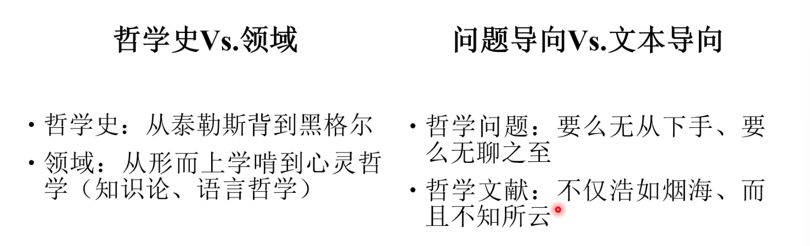
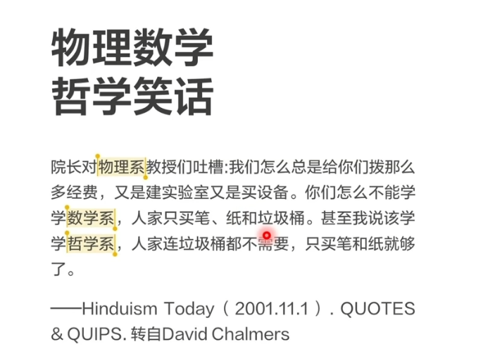
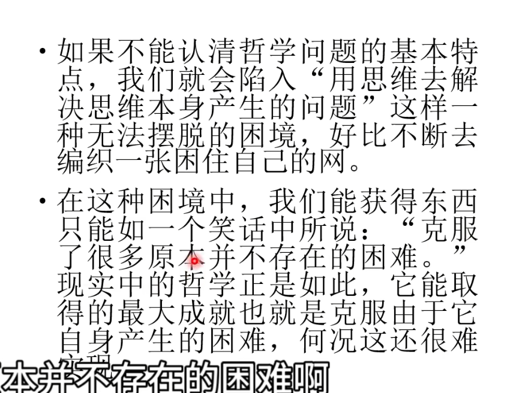

# 第一讲  导论

## 1.课程原则 00:20

本次导论课程包含两部分内容：课程原则与安排（含参考书目及考试要求）和哲学常见迷信与误区（共十个要点）。

##### 1) 上课原则 00:48

课程采用"三无"教学模式：无课外阅读、无小组作业、无课堂报告。该模式基于教育有效性考量，与常规教学形式存在差异。

##### 2) 一般性原则 01:18

- 思考 > 文本 > 记忆

  思考优先原则：思考价值高于文本研读，文本研读价值高于机械记忆 

- 文本研读范围：包括一手文献与二手文献，但需注意文本研读需以思考为基础 

- 论文写作建议：本科阶段除学年论文与毕业论文外，不建议进行低水平重复的论文写作，强调厚积薄发的学术积累规律 

#### 2.大学教育目的 02:58

本科教育本质应为多元发展平台，而非单一学术人才培养。当前教育存在将本科教育等同于学术研究培养的误区，表现为： 

- 重文献、轻思考：过度强调文献阅读而忽视思考训练 
- 重论文、轻积累：过早要求论文写作而缺乏必要积累 
- 重学术、轻问题：偏重学术规范而轻视思维培养 

#### 3.知识、思考、哲学、学术 05:15

##### 1) 知识、思考、哲学与学术的区分 05:18

- 知识范畴：记录性内容（如"某人提出某观点"） 
- 思考范畴：对知识内容的批判性分析（如"某观点是否正确"） 
- 哲学范畴：针对特定领域（如形而上学、知识论）的深度思考 
- 学术范畴：系统化、规范化的思考成果表达 

##### 2) 例题1:知识、思考、哲学与学术的实例分析 06:31

以柏拉图《理想国》为例： 

- 历史事实（如柏拉图生卒年）属于知识层面 
- 文本内容（如对话人物言论）属于文本分析层面 
- 观点批判（如正义理论正确性）需进入思考层面 
- 哲学探讨需聚焦特定问题领域（如理念论） 
- 学术研究需完成系统化论证与规范表达 

##### 3) 罗素名言解读：无知与愚蠢的区别 09:01

罗素观点指出： 

- 无知是认知的初始状态 
- 愚蠢源于错误的教育引导 
- 哲学教育应避免将无知转化为愚蠢 

#### 3.教授哲学的不同方式 14:49

哲学教学存在特殊困难，主要源于其高度抽象性。常见教学模式可通过二维坐标进行类型划分（具体分类未完整呈现）。

##### 1) 哲学史脉络教授法 15:26

哲学史脉络教授法是从时间线索系统梳理哲学发展的方法。西方哲学史课程通常从古希腊哲学开始，延续至德国古典哲学，形成清晰的时间链条。哲学史一般以黑格尔为终点，因马克思在中国意识形态中的特殊地位而有所区分。该方法的优势在于历史线索明确，但存在后人概括与历史事实不符的缺陷。哲学史中的各种“转向”概念属于后人总结，实际思想发展过程更为复杂。 

##### 2) 哲学领域划分教授法 17:19

当代分析哲学将哲学划分为四个核心领域： 

- 形而上学（亚里士多德时期将详细解释） 

- 心灵哲学 

- 知识论（马克思主义哲学中称为认识论） 

- 语言哲学

  该分类体系具有学术规范性，但各领域界限存在高度重叠现象。以笛卡尔《第一哲学沉思集》为例，同一文本可能同时涉及多个哲学领域，体现分类的人为性。 

##### 3) 问题导向与文本导向教授法 18:27

| 教学导向 |       优势       |            局限性            |
| :------: | :--------------: | :--------------------------: |
| 问题导向 |   逻辑线索清晰   | 问题切入点困难或讨论流于琐碎 |
| 文本导向 | 经典文本解读系统 | 文献体量庞大（如柏拉图全集） |

两种教学范式各具特点，不存在绝对优劣之分。 

##### 4) 课程采取的教授范式 19:24

本课程采用传统哲学史脉络教学法，按时间顺序系统梳理西方哲学发展历程。 

#### 4.课程具体安排与参考书目 19:33

## 2.具体安排与参考书目

课程分为四个模块，每模块安排三次授课： 

- 早期希腊哲学：
  - 伊奥尼亚学派
  - 爱利亚学派
  - 毕达哥拉斯学派
  - 多元论者与
  - 原子论者 
  - 智者运动
- 苏格拉底分期作用：“前苏格拉底哲学”与“后苏格拉底哲学”的划分依据，涉及辩证法、精神助产术等核心概念 
  - “认识你自己”
  - “德性就是知识”
  - “辩证法”
  - “精神助产术”

- 柏拉图哲学（2次课）：
  - “理念论”
  - 三大比喻（太阳/洞穴/线段）、
  - 灵魂三分说、
  - 政治哲学 
  - “摹仿说”

- 亚里士多德哲学（ - 5次课）： 
  - 物理学
  - 形而上学
  - 伦理学
  - 政治学
  - 诗学

- 晚期希腊哲学
  - “希腊化”
  - 伊壁鸠鲁学派
  - 斯多亚学派
  - 怀疑主义
  - 新柏拉图主义）

- 基督教哲学： 
  - 基督教与希腊思想的交融
  - 奥古斯丁
  - 托马斯·阿奎那

#### 7.推荐书目 24:26

##### 1) 教材的角色与局限性 24:31

哲学教材本质是辅助工具，存在三方面局限： 

- 表述简略化：用数百字概括原著（如《理想国》）必然丢失细节 
- 观点选择性：不同教材对同一理论的表述可能矛盾 
- 认知误导风险：将教材表述等同于哲学思想本身（如同用π≈3进行航天计算）教材应作为“引桥”使用，而非研究依据。 

##### 2) 推荐教材：西方哲学简史 25:07

赵敦华《西方哲学简史》特点： 

- 经典中文教材，北京大学哲学系沿用 
- 框架清晰，完整覆盖核心哲学议题 
- 篇幅精炼，适合基础学习阶段使用 

##### 3) 推荐教材：学院自编西方哲学史教材 25:33

学院自编教材特点： 

- 集体编撰，反映当前教学需求 
- 内容覆盖全面，但存在教材普遍局限性 
- 需配合原始文献使用，避免形成认知偏差 

##### 4) 啃教材不过瘾怎么办？自己去找更多东西看 28:21

进阶学习资源使用建议： 

- 中国社会科学院《西方哲学史》（学术版）： 
  - 11卷本巨著，资料详实但术语体系较旧 
  - 适合作为专题研究跳板 -  Kenny《新西方哲学史》： 
  - 英文原版教材，包含非常规哲学家（如伽利略） 
  - 编排创新但逻辑线索需自行梳理 
- 参考文献利用法： 
  - 追踪教材 / 论文引用书目建立个人阅读体系 
  - 以问题 / 人物为中心展开延伸阅读

##### 5) 中世纪部分推荐书目 31:29

基督教哲学是中世纪研究的专门领域，具有较高学术门槛。推荐书目如下： 

- 《基督教哲学1500年》（赵东华著，北京大学出版）：学术专著，但版本较旧（2000年代或1990年代出版）。 
- 安特尼《中世纪哲学》： 
  - 绿色合订版：四卷合印，内容厚重。 
  - 分卷版：电子版常见，第二卷专门论述中世纪哲学（Medieval Philosophy）。 
- 《古代中世纪哲学史五讲》（吴天悦著，北京大学出版）：作者为领域内权威，内容可信。 

##### 6) 还不过瘾怎么办？科学上网为你排忧解难 32:55

推荐利用网络资源进行深入研究： 

- 斯坦福哲学百科（Stanford Encyclopedia of Philosophy, SEP）： 
  - 权威性：词条由领域内权威学者撰写，专业性强。 
  - 时效性：定期更新，反映当前学术进展。 
  - 内容覆盖：涵盖人物（如柏拉图）、著作（如《理想国》）、核心概念（如理念论）等。 
  - 参考书目：提供详细文献指引，适合初学者入门。课件资料将课后统一发放，无需课堂记录。

## 3.关于哲学的常见迷信与误区

哲学领域存在诸多常见迷信与误区，现将其归纳为十个要点。哲学概念具有高度多元性，不同个体对哲学的理解可能存在显著差异。哲学研究范围随学科分化逐渐缩小，这是哲学发展的必然趋势。哲学讨论中达成共识极为困难，尤其在基础概念层面争议持续存在。

### 1.大家说的哲学都是一回事 00:39

哲学概念具有显著歧义性，其含义远比其他学科名称更为复杂。常见理解包括：

- 含义一：系统化理论或思想：与哲学存在外延重合但内涵无必然联系
  - 内涵：概念所指的意思
  - 外延：概念所指的东西
- 含义二：世界根本规律或本质：该定义面临科学方法论挑战
- 含义三：三观体系（世界观、人生观、价值观）：具有普遍性但缺乏评判标准

哲学专业内部也存在理解分歧，这种现象在其他学科中较为罕见。定义哲学需考虑其历史发展特征，即新学科不断从中分化独立的过程。

##### 1) 罗素的概括 06:36

罗素在《哲学问题》中提出：哲学本质是对根本问题的探究与批判。其核心特征表现为：

- 形成新学科：当探究获得确定基础时即转化为独立学科
- 动态边界：哲学领域随知识体系发展持续调整
- 方法论特征：强调批判性而非结论性

该定义能有效解释学科衍生史和哲学领域收缩两大历史现象。

##### 2) 哲学与其他学科的关系 08:14

| 关系类型 |          表现特征          |       典型例证       |
| :------: | :------------------------: | :------------------: |
| 学科衍生 | 自然科学等多数学科源自哲学 | 物理学脱胎于自然哲学 |
| 方法融合 |   新学科继承哲学批判精神   |   社会科学研究范式   |
| 领域让渡 |    成熟问题转为专门学科    |   牛顿力学独立过程   |

##### 3) 哲学领域的变窄 09:01

哲学研究范围呈现历史性收缩，主要表现为：

- 自然哲学转化为现代物理学体系
- 道德哲学分化为伦理学等学科
- 逻辑研究发展为形式科学分支

该过程印证哲学作为学科母体的功能，其领域缩减与知识体系完善呈正相关。

##### 4) 哲学中取得共识极困难 10:07

哲学讨论具有根本性争议特征：

- 基础概念缺乏统一定义
- 方法论存在多元路径
- 价值判断难以客观验证

这种现象源于哲学问题的元理论性质和批判性本质。

##### 5) 使用一个概念之前，必须澄清它的含义 10:41

概念界定是哲学讨论的前提条件。哲学术语具有：

- 语义弹性：允许多元解释空间
- 领域包容：涵盖跨学科议题
- 交流障碍：易产生理解偏差

明确概念边界可避免无效争论，这是哲学方法论的基本要求。

### 2.哲学地位最高，是“科学之科学”

- 现代学科地位平等，任何学科都不存在天然的高低贵贱之分 
- 哲学作为现代学科仅涵盖历史哲学体系中的一小部分，与其他学科具有同等学术价值 

#### 1) 现代哲学含义解析 02:24

| 对比维度 | 传统哲学                       | 现代哲学                             |
| :------: | ------------------------------ | ------------------------------------ |
| 学科范畴 | 涵盖心理学、政治学等学科的源头 | 仅作为独立学科存在                   |
| 学术分工 | 哲学家掌握跨领域知识           | 严格限定研究范围，不涉足其他专业领域 |
| 因果关系 | 哲学家因个人能力卓越而著名     | 学科属性与个人成就无必然联系         |
| 社会影响 | 具有广泛社会影响力             | 影响力局限于学术圈内                 |

#### 2) 现代哲学学科总结 04:13

现代哲学学科具有明确的专业壁垒，不存在通过哲学学习实现跨学科触类旁通的可能性。获取特定领域知识必须进行专业学习，所谓“科学之科学”的定位不符合现代学术体系分工现实。

### 3.哲学就是“输出”观点，让别人认可自己

哲学常被误解为单纯输出观点并让他人接受的行为。若某种活动仅以让他人接受特定观点为目的，则其性质与诈骗或传销类似。哲学的目的不应是说服他人接受既定观点，而应致力于**真理探究**。哲学思考的本质在于通过对话使真理自然显现，而非预先确定对错立场。

#### 1.例题:高速公路路牌装反了 01:13

当驾驶员认为高速公路路牌方向错误时，其判断可能反映主观认知与客观现实的冲突。若将个人观点包装为哲学论述，可能掩盖其本质上的逻辑缺陷。哲学讨论需区别于单纯坚持自我立场的表达，后者更接近辩论或营销行为。

#### 2.例题:辩论赛与哲学的目的 02:03

- 辩论的核心目标是胜负，而哲学的本质是通过对话揭示真理。
- 辩证法（dialectics）的词源本意为对话，其核心机制是在交流过程中自然呈现真伪。
- 哲学探究的前提是承认自身认知的局限性，若讨论者预设绝对正确立场，则已偏离哲学本质。

### 4.哲学就是比赛说黑话 00:01

哲学学习中最常见的错误是模仿哲学家创造炫酷概念。哲学文献通常具有晦涩难懂和包含大量专业术语两个特点，例如柏拉图的《理想国》相对友好，而亚里士多德的著作则更难理解。哲学并非以创造晦涩概念为目的的领域，真理应当能够用通俗语言表达。

#### 1.哲学黑话生成器 01:42

哲学黑话生成器现象反映了对哲学的误解，哲学家使用特定术语并非为了晦涩，而是存在深层原因。例如柏拉图使用"理念"一词而非更通俗的概念，需要探究其背后的动机。理解哲学术语的关键在于分析其必要性而非简单记忆。

#### 2.概念是有生命力的 02:22

哲学概念的生命力取决于其必要性。以康德的"感性直观"为例，需要理解其使用理由而非仅记忆定义。概念的简洁性不能作为其合理性的唯一依据，必须考察其论证基础。哲学与生活的关系需要辩证看待，不能简单认为哲学必须脱离生活。

##### 1) 哲学家创造概念以表达日常概念无法表达的意思 04:08

哲学家创造新概念的根本原因是日常语言无法准确表达特定思想。概念合理性需要充足理由支持，不能仅基于个人对哲学的特定理解。哲学史上经得起考验的概念都具有充分论证基础。

##### 2) 理由构成了概念的生命力 05:22

概念的生命力与其论证理由的充分性直接相关。理解哲学概念需要把握其使用理由和论证过程，而非仅作名词解释。柏拉图的"理念"、亚里士多德的"实体"和康德的"先天综合判断"都是典型例证。

##### 3) 哲学史上经典的例子 06:12

哲学史上的经典概念具有高度不可替代性。这  些概念经过反复比较和考量，使用理由充分，如柏拉图的理念论和康德的先验哲学体系。概念的经典地位源于其解决问题的有效性。

##### 4) 哲学史上失败的例子 06:36

当代哲学中存在大量缺乏生命力的概念，这些概念往往只是对日常语言的包装。对待哲学应持批判态度，区分有价值的概念和纯粹的黑话。学习哲学需要辨别精华与糟粕，不能盲目接受所有哲学家的观点。

### 5.哲学“有用”，可以直接解释现象或指导实践

哲学的实际效用存在特定限制。哲学并非直接用于解释现象或指导实践，其作用方式具有独特性。关于哲学是否有用的讨论需要明确"有用"的具体含义，任何事物理论上都具有某种效用。关键在于阐明哲学的具体应用方式，而非简单判断其有用与否。哲学的传统应用方式包括解释现象和指导实践，但需要区分直接与间接的应用。

#### 1.例题:福柯理论应用 01:16

福柯理论应用案例的分析要点：

- 理论正确性预设：应用理论解释现象时首先预设该理论本身正确
- 理论相关性预设：其次预设该理论与待解释现象存在关联
- 验证必要性：两种预设都需要提供充分理由而非默认成立
- 理论检验领域：判断理论正确性属于哲学密切相关的领域

#### 2.现象走到尽头才有理论，理论走到尽头才有哲学 03:54

哲学往往与具体的现象或实践无直接关联

哲学与现象的关系层级：

|   层级   |     特征     |     关系     |
| :------: | :----------: | :----------: |
| 现象观察 | 直接经验层面 | 理论来源基础 |
| 理论构建 | 现象归纳总结 | 哲学思考前提 |
| 哲学抽象 | 理论极端推演 | 最终思维形态 |

哲学的特殊性：

- 作用对象：主要针对理论本身而非直接应对现象
- 自我指涉：哲学常需处理自身理论体系的问题
- 实践检验：哲学正确性需通过实践验证而非直接指导实践
- 间接关联：哲学与具体现象之间存在理论中介层

### 6.哲学可以解答人生的根本困惑，获得终极真理

第六个困惑是认为哲学可以解答人生的根本困惑并获得终极真理。

#### 1) 根本性的困惑 00:24

根本性困惑的核心问题包括： 

- 自我认知问题（我是谁） 
- 起源问题（我从哪来） 
- 目的问题（我到哪去）

这些问题具有重要性且普遍困扰人类，但其答案的形态和获取途径尚不明确。

#### 2) 哲学解答人生困惑 01:02

哲学无法有效解答人生根本困惑： 

- 现实哲学提供的答案通常缺乏可靠性，难以经受反驳检验 
- 靠谱的哲学从业者往往回避此类问题，因其超出纯粹理论与思辨范畴 
- 抽象思辨与人生实践存在频率差异，存在主义案例（如溺水者困境）表明哲学无法解决现实困境 

#### 3) 追求幸福 02:26

部分人将哲学目标降级为追求幸福感的工具，但该路径同样存在问题。

#### 4) 学习哲学痛苦且正反馈极少 02:37

哲学学习的负面特征： 

- 学习过程通常伴随痛苦加剧 
- 正反馈机制极度匮乏 
- 长期坚持者多呈现情感麻木状态（以哲学教师群体为典型）

#### 5) 哲学系学生调查 02:51

|    群体    |      人格特质分布       |    生存率影响因素    |
| :--------: | :---------------------: | :------------------: |
| 哲学系学生 |  F型（情感型）占比较高  | 情感需求者易中途淘汰 |
|  哲学教师  | T型（思考型）占绝对优势 |  理性特质者更易留存  |

#### 6.学习哲学变得盲目 03:19

哲学研究的潜在异化效应： 

- 学术理解与幸福感脱节，仅可能产生微量成就感 
- 核心结论重申：人生根本问题的解答与幸福追求均不存在于哲学领域 
- 黑格尔案例的普适性：任何哲学体系的掌握均不必然导向幸福

### 7.哲学家是圣人、哲学原著是经书

#### 1) 哲学家是圣人、哲学原著是经书概念 00:03

精神平等原则是破除该迷信的核心依据。所有人（包括哲学家、师生、亲属）在精神层面具有绝对平等性，这种平等性与个体能力差异无关。对哲学成果的理性仰视是可取的，但需避免在精神层面产生卑微姿态。

#### 2) 离开平等原则的危险 01:01

丧失精神平等将导致"夺魂现象"，表现为研究者与研究对象的人格混淆（如福柯研究者成为"小福柯"）。哲学学习范式具有以下特征： 

- 偶像化风险：将哲学家类比为庙宇供奉的神佛 
- 价值提取误区：需区分哲学家的有价值思想与盲目崇拜行为 
- 专业普遍性：类似现象在其他学科领域同样存在，仅崇拜对象不同 

关键警示：若将哲学目的误解为"在思想庙宇中跪拜"，则彻底背离哲学本质。

#### 3) 哲学家不可能说的都对 02:43

哲学理论互斥性原理可通过以下维度说明： 

| 对比维度 |  柏拉图理论  | 亚里士多德理论 |      逻辑结论      |
| :------: | :----------: | :------------: | :----------------: |
| 理论方向 |    理念论    |     经验论     |      完全相反      |
| 真值关系 |   若A正确    |   B必然错误    | 二者不可能同时正确 |
| 认知选择 | 可能单方正确 |  可能双方皆误  |  需保持批判性距离  |

核心方法论：当被某哲学体系说服时，必须思考其他体系的对应错误。保持思想自主性的关键在于拒绝任何形式的理论跪拜，牢记灵魂平等原则高于学术权威。

### 8.哲学家崇高伟大，拥有高尚的道德情操 00:01

关于哲学家崇高伟大的认知存在误区。伟大与伟人这类词汇容易造成认知遮蔽，更准确的表述应为某人在特定领域具有突出贡献。哲学家群体中，高尚道德情操并非普遍特质，其道德表现与所属领域存在相关性。

#### 1.写出感人诗句的诗人是个酷吏 00:46

文学创作水平与作者道德品格的关联性分析：

- 《悯农》作者李绅的史实考据显示存在严重道德缺陷
- 文学作品价值与创作者人格呈现弱相关性
- 审美判断应独立于创作者道德评价

#### 2.杰出的科学家是政治上的糊涂虫 01:41

| 人物   | 科学贡献           | 政治立场         | 历史争议                     |
| ------ | ------------------ | ---------------- | ---------------------------- |
| 海森堡 | 提出测不准原理     | 积极支持纳粹政权 | 核武器研发计算失误的动机争议 |
|        | 量子力学奠基性工作 | 参与纳粹核计划   | 学术成就与政治选择的分离性   |

#### 3.哲学与品行关系 03:29

哲学成就与个人品行不存在必然关联。哲学作为特殊学科领域，其理论价值与践行者的人格特质呈现复杂关系，需进行区分判断。

##### 1) 哲学与品行关系举例 03:42

哲学家个案分析表明：

- 罗素在数理逻辑领域的成就与混乱情史并存
- 海德格尔存在哲学贡献与纳粹倾向形成鲜明对比
- 哲学理论价值应独立于创立者的生活实践进行评判学科复杂性体现在理论体系与践行者行为的割裂现象，需避免盲目崇拜。

### 9.哲学可以像自然科学那样不断“进步” 00:03

关于哲学能否像自然科学那样不断进步的观点存在争议。将自然科学中最抽象的部分视为科学哲学，并认为其与自然科学同步发展，这种说法具有一定合理性。然而，传统意义上的哲学本质上无法实现持续进步，其发展模式与自然科学存在根本差异。

#### 1) 哲学从业者的观点 00:30

部分哲学从业者坚持认为哲学具有与科学相似的发展特性。这种认知差异源于对学科本质的不同理解。哲学若承认自身不具备持续进步性，将面临学科价值质疑： 

- 学科地位问题：非发展性学科易被视为缺乏学术活力 
- 存在必要性：可能引发对哲学研究经费与机构存续的争议 

#### 2) 哲学问题的特点 01:03

哲学问题具有两个本质特征： 

- 思维内生性：哲学问题是人类思维规律的产物，与客观世界无必然关联，属于纯粹思维活动 
- 问题有限性： 
  - 核心问题数量恒定：约数十个基本问题 
  - 表现形式可变：随时代语境产生变形 

哲学停滞性根源在于其研究对象涉及人类思维与本性的深层结构，这些要素具有历史恒常性。类似现象可见于宗教领域，其教义核心同样保持相对稳定。但哲学的特殊困境在于无法坦然接受自身的非发展特性。

#### 3) 物理数学哲学的笑话 03:02

|   学科   |  研究工具   |       隐 喻含义        |
| :------: | :---------: | :--------------------: |
| 自然科学 |  实验设备   |      依赖物质投入      |
|   数学   | 笔纸+垃圾桶 |   纯思维活动产生废料   |
|   哲学   | 无工具需求  | 思维产物皆可被赋予价值 |

该笑话揭示哲学研究的特殊性：其成果评价标准不同于实证科学，思维过程本身即被视为有价值产出。

#### 4) 用思维解决思维问题 03:53

将哲学类比为自然科学发展的认知会导致逻辑困境：试图用思维工具解决思维自身产生的问题，这本质上形成自我指涉的闭环。苏联笑话"我们最大的成就是克服了原本不存在的困难"准确描述了哲学研究的悖论状态——哲学所应对的困境往往源于其自身的理论建构。这种特性构成哲学区别于其他学科的根本特征。

### 10.学习哲学，从娃娃抓起

最后一个迷信现象是认为学习哲学可以从幼儿阶段开始。

#### 2) 年龄限制 00:47

某些活动需设定年龄限制，因其需要特定成熟度才能参与。哲学是否适用年龄限制取决于其本质特性，若仅如胎教般无害则可行，但哲学的实际属性需进一步探讨。

#### 3) 哲学是否需要分级 01:19

##### 1) 哲学需要理性和思辨 01:21

哲学不仅依赖理性和思辨，更需要心智成熟与经验积累。缺乏心理成熟度及对社会、世界的必要认知时接触哲学易引发问题。

##### 2) 过早接触哲学不利于心智成长 01:46

不恰当的早期哲学接触可能导致偏激与狭隘。因崇拜思想家而全盘接受其观点，会限制自身思想发展框架。哲学系中部分学生思想固化现象与此相关。

##### 3) 不恰当接触哲学使人狭隘偏激 02:17

过早接触超出认知能力的哲学内容是不可逆风险的主要成因。该现象在哲学学习者中具有普遍性。

##### 4) 哲学普及或儿童哲学分级 02:46

哲学普及工作需建立内容分级机制，非所有哲学内容都适合未成年人学习。第十个迷信的结论是哲学教育应遵循心智发展规律。

## 4.真正可以教的哲学是什么

“哲学”究竟可以提供什么?

哲学的可教内容主要包括三个方面：人类在哲学领域内进行探索的正反面经验、西方哲学进行思考和讨论的基本思路与范式，以及哲学的角色与有限性。学习哲学的关键在于理解学科的有限性和实际用法，而非盲目推崇其理论。 

#### 1.人类在哲学领域内进行探索的正反面经验 00:58

哲学史和哲学文本的核心价值在于总结人类已有的哲学思考和讨论经验。这些经验可以通过传递和分享进行学习，是哲学教育的基础内容。 

#### 2.西方哲学进行思考和讨论的基本思路与范式 01:19

西方哲学形成了系统化的思考与讨论范式，这些范式是对零散经验的抽象提炼。学习这些思路与范式有助于理解哲学问题的分析框架。 

#### 3.哲学的角色与有限性 01:37

哲学的作用和局限性需明确：其积极意义在于特定领域的应用价值，但适用范围非常有限。与其他学科类似，哲学无法解决所有问题，需理性看待其边界。 

#### 4.能够实现的目标：一条龙服务 02:09

##### 1) 掌握必要的西方哲学知识 02:18

学习目标之一是掌握基础西方哲学知识，达到能够辨别观点真伪的程度。避免被误导或误导他人是知识掌握的最低标准。 

##### 2) 学会自己解决学习中遇到的基本问题 02:37

独立解决学习中的基本问题是核心能力之一。解决问题的过程本身即是对思维的训练，有助于提升哲学分析能力。 

##### 3) 认识你自己 02:56

苏格拉底“认识你自己”的原则强调自我认知的重要性。判断是否适合学习哲学或选择其他方向需基于对自身的了解，而非外部建议。这一原则是哲学学习的终极目标。
